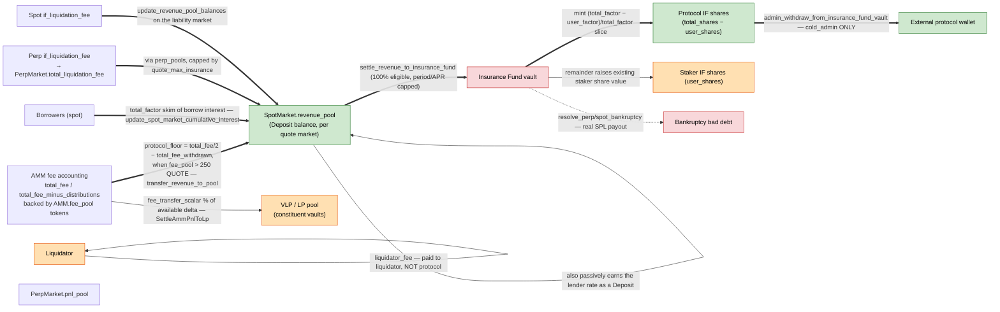

# Drift Protocol v2 — Architecture

Navigation map for `programs/drift` and `sdk/`. Start here to find the right file for any query.

---

## Module Responsibility Matrix

| Module | Owns | Does NOT own |
|---|---|---|
| `programs/drift/src/instructions/` | Account constraint structs, Anchor deserialization, input validation, delegation to `controller` | Business logic, math |
| `programs/drift/src/controller/` | Stateful mutations: fills, liquidations, position updates, funding | Account loading (done by `instructions`), pure math |
| `programs/drift/src/math/` | Pure numeric functions: margin, fees, funding, AMM pricing, oracle checks | Any account I/O or state mutation |
| `programs/drift/src/state/` | Account struct definitions and accessor/mutation methods | Instruction routing, math |
| `programs/drift/src/validation/` | Pre-mutation precondition checks (called by `instructions` before `controller`) | Post-trade checks (those live in `math/margin`) |

---

## Execution Flows

### Place Perp Order
1. User calls `place_perp_order` → `instructions/user.rs` (`PlacePerpOrder` context)
2. → `validation::order::validate_order` (`validation/order.rs`)
3. → `controller::orders::place_perp_order` (`controller/orders.rs`)
4. → `math::orders::standardize_base_asset_amount` + auction parameter derivation
5. → `state::user::add_order` writes order to `User` account

### Fill Perp Order (keeper crank)
1. Keeper calls `fill_perp_order` → `instructions/keeper.rs` (`FillPerpOrder` context)
2. → `controller::orders::fill_perp_order` (`controller/orders.rs`)
3. → `math::margin::calculate_margin_requirement` (pre-fill margin check)
4. → `controller::orders::fulfill_perp_order_with_match` (maker matching loop)
5. → `controller::position::update_position_and_market` (`controller/position.rs`)
6. → `controller::orders::update_order_after_fill` + bookkeeping
7. → emits `OrderActionRecord` event (`state/events.rs`)

### Liquidate Perp
1. Keeper calls `liquidate_perp` → `instructions/keeper.rs`
2. → `controller::liquidation::liquidate_perp` (`controller/liquidation.rs`)
3. → `math::margin::calculate_margin_requirement` (confirms liquidatable)
4. → `math::liquidation::calculate_perp_liquidation_price` + fee
5. → `controller::position::update_position_and_market`
6. → emits `LiquidationRecord`

### Settle PnL
1. Keeper calls `settle_pnl` → `instructions/keeper.rs`
2. → `controller::pnl::settle_funding_payment` (`controller/pnl.rs`)
3. → `math::pnl::calculate_per_lp_position`
4. → mutates `PerpMarket.pnl_pool` and `User` position

### Update Funding Rate
1. Keeper calls `update_funding_rate` → `instructions/keeper.rs`
2. → `controller::funding::update_funding_rate` (`controller/funding.rs`)
3. → `math::funding::calculate_funding_rate` (TWAP-based)
4. → writes `PerpMarket.amm.last_funding_rate`

---

## Fee & Revenue Flow

This section maps every fee the protocol charges, where it goes, and — critically — which flows are **protocol-retained revenue** vs **pass-throughs** (paid straight back out to a user/keeper/builder) vs **liability-offsetting** (insurance-fund inflows that pre-fund bankruptcy payouts). It reflects the post-relaunch (Velocity) codebase, which differs materially from upstream Drift.

### Fork-specific facts that change the picture

- **Spot trading produces no fee revenue.** The swap fee is hardcoded `let fee = 0_u64;` (`instructions/user.rs:3949`). There is no spot order-book fill path in this fork (`fulfill_spot_order` does not exist); spot trades go through `begin_swap`/`end_swap` and `lp_pool_swap`. Consequently `SpotMarket.total_spot_fee`, `spot_fee_pool`, and `total_swap_fee` are **dead/zeroed fields** — ignore them when accounting revenue.
- **Perp taker fees are the only trading-fee revenue.**
- **The protocol already keeps only ½ of net perp fees.** `SHARE_OF_FEES_ALLOCATED_TO_DRIFT = 1/2` (`math/constants.rs:111-112`); the other half is an AMM/PnL buffer.
- **The AMM moved into `src/vlp/`** (VLP = the decoupled AMM, rebranded DLP). AMM fee counters (`total_fee`, `total_mm_fee`, `total_fee_minus_distributions`, `total_fee_withdrawn`, `fee_pool`) now live on `vlp/amm/state.rs`, **not** `PerpMarket`. `lp_fee_transfer_scalar` was relocated to `HedgeConfig.fee_transfer_scalar` (`vlp/hedge/state.rs:80`).

### Diagram 1 — Perp taker-fee decomposition (per fill)

The carve-out order, all in `math/fees.rs` (`calculate_fee_for_fulfillment_with_amm` ~:36-142, `_with_match` ~:263-332):


Only the bold `fee_to_market` path (green) is candidate protocol revenue; everything else (orange) is a pass-through to a user/keeper/builder. **`builder_fee` is additive** — it does not reduce `fee_to_market`, and it is funded out of the perp `pnl_pool` at settle time, so it is a pure pass-through to the builder.

### Diagram 2 — Pool movement map (where value lives and moves)

Arrows are labeled with the action/instruction that moves value. Solid green = becomes protocol-retained; orange = pass-through; red dashed = outflow/liability.



**The only real cash exit for the protocol** is the bottom path: `revenue_pool → IF vault → protocol IF shares → cold_admin withdraws` via `admin_withdraw_from_insurance_fund_vault` (`if_staker.rs:1241`, gated to `state.cold_admin`, must leave ≥1 protocol share). `revenue_pool` itself has no admin→wallet withdraw; its only exits are settling to the IF or covering an underwater perp market.

### Classification table

| Flow | On-chain field / instruction | Class |
|---|---|---|
| Perp taker fee (gross) | `PerpMarket.total_exchange_fee`, `UserStats.total_fees` | Gross revenue |
| `fee_to_market` (net of filler/referrer/referee/maker) | `AMM.total_fee`, `total_fee_minus_distributions` | Net trading fee (½ retained) |
| AMM spread surplus | `AMM.total_mm_fee` | Included in `total_fee` |
| Protocol share settled to revenue pool | `AMM.total_fee_withdrawn` (realized meter); `transfer_revenue_to_pool` | **Protocol revenue** |
| Lending: `total_factor` skim of borrow interest | `controller/spot_balance.rs:147-171` → `revenue_pool` | **Protocol revenue** (shared w/ stakers at settle) |
| Protocol IF shares | `total_shares − user_shares`; `admin_withdraw_from_insurance_fund_vault` | **Protocol revenue (withdrawable, at-risk)** |
| Maker rebate | `UserStats.total_rebate` | Pass-through (to maker) |
| Referrer reward (15%) | `RevenueShareEscrow` → `RevenueShare.total_referrer_rewards` | Pass-through (to referrer) |
| Referee discount (5%) | `UserStats.total_referee_discount` | Not collected (fee reduction) |
| Filler/keeper reward | filler `PerpPosition` quote PnL | Pass-through (to keeper) |
| Builder fee (additive) | `RevenueShareEscrow` → `RevenueShare.total_builder_rewards` | Pass-through (to builder) |
| Perp `liquidator_fee` | symmetric quote transfer user→liquidator | Pass-through (to liquidator) |
| Perp/spot `if_liquidation_fee` | `total_liquidation_fee` / `revenue_pool` | Liability-offset (IF pre-funds bankruptcies) |
| LP `fee_transfer_scalar` slice, swap fees, mint/redeem fees | `LPPool` / `Constituent` (`vlp/hedge/state.rs`) | LP-holder revenue |
| Staker IF shares | `InsuranceFund.user_shares` | Staker-owned liability |
| User-init rent | `State.max_initialize_user_fee` | Solana rent, not revenue |

### Lending / insurance-fund mechanics (the subtle part)

- **`total_factor` is a skim, not just passive yield.** In `update_spot_market_cumulative_interest` (`controller/spot_balance.rs:130-185`), `deposit_interest_for_stakers = deposit_interest × total_factor / 1e6` is split off the top and deposited into `revenue_pool`; only `deposit_interest − that` is compounded to lenders. So the prior framing ("revenue pool just earns lend yield like any depositor") captures a *second, smaller* effect (the revenue_pool balance is a `Deposit` and does earn the lender rate), but the **primary** lending revenue is the `total_factor` skim on borrower interest.
- **`total_factor` vs `user_factor` at settle** (`controller/insurance.rs:758-775`): when `revenue_pool` settles to the IF, the protocol's slice is `(total_factor − user_factor)/total_factor`, minted as **new IF shares to `total_shares` only** → grows protocol's claim. The `user_factor` portion instead raises existing stakers' share value. So `total_factor` = total fraction of interest routed to the IF; `user_factor` = the sub-fraction that benefits stakers; the gap is the protocol's own accrual.
- **The IF is a two-way book.** `resolve_perp_bankruptcy` / `resolve_spot_bankruptcy` make real SPL payouts from the IF vault (`keeper.rs:2069-2078`, `:2187-2196`). So liquidation `if_fee`s and the protocol's IF shares are *at-risk capital* that absorbs bad debt before being withdrawable — not clean P&L.

### Defining "net trading fees" and the recovery-pool number

For a dashboard, the chain of definitions and their **source of truth**:

1. **Gross taker fees (perp).** Per-user lifetime: `UserStats.total_fees`. Per-market: `PerpMarket.total_exchange_fee` — **but caveat:** this field adds gross `user_fee` on AMM-house fills yet net `fee_to_market` on DLOB-matched fills (`orders.rs:2269` vs `:2579`), so it is *not* a clean gross meter. Spot contributes **0**.
2. **Deductions / pass-throughs.** maker rebate (`UserStats.total_rebate`), referrer reward (`RevenueShare.total_referrer_rewards`), referee discount (`UserStats.total_referee_discount`), filler reward (no single accumulator — derive from `OrderActionRecord.filler_reward` events), builder fee (`RevenueShare.total_builder_rewards`).
3. **Net trading fees = `fee_to_market`** (the remainder after filler + referrer [+ maker in match path]; referee discount already removed upstream; builder fee never included). The closest single account field is **`AMM.total_fee`** — but it only captures AMM-house fills; pure DLOB-matched fills land in `total_exchange_fee` and skip `apply_fill_fees`. **No single on-chain field cleanly equals "net trading fees" across both fill types** — the reliable source of truth is event-based accounting off `OrderActionRecord` (sum `taker_fee − maker_rebate − referrer_reward − filler_reward`, excluding the builder portion bundled into `taker_fee`).
4. **What the protocol actually retains today is ½ of net** (`SHARE_OF_FEES_ALLOCATED_TO_DRIFT`), realized as growth in `AMM.total_fee_withdrawn` when it settles to `revenue_pool`. So a "75% of net trading fees" recovery allocation is **not** the same basis as the existing 50/50 protocol/AMM split — it would need to be defined as a new carve and reconciled against that split. **This number is not defined in code; it must be specified before it can be implemented or dashboarded.**

> Open question to resolve with the team: is the recovery pool meant to take 75% of **gross taker fees**, of **net-of-pass-through fees**, or of the **protocol's ½ retained share**? Each is a different field set above, and they differ by ~2-4x.

---

## Account Type Locations

| Type | File | Notes |
|---|---|---|
| `User` | `state/user.rs` | Zero-copy, `AccountLoader`. Holds positions, open orders, margin info. |
| `UserStats` | `state/user.rs` | Companion to `User`, tracks volume/fees/referrals. |
| `PerpMarket` | `state/perp_market.rs` | Zero-copy. Embeds `AMM` struct for AMM state. |
| `SpotMarket` | `state/spot_market.rs` | Zero-copy. Tracks deposits/borrows, oracle, insurance. |
| `State` | `state/state.rs` | Global protocol config: fees, admin pubkey, number of markets. |
| `InsuranceFundStake` | `state/insurance_fund_stake.rs` | Per-user IF stake position. |
| `OracleMap` | `state/oracle_map.rs` | Per-instruction oracle account loader, built from `remaining_accounts`. |
| `OrderParams` | `state/order_params.rs` | Shared input struct for place/modify order instructions. |
| All events | `state/events.rs` | `OrderActionRecord`, `DepositRecord`, `LiquidationRecord`, `FundingPaymentRecord`, etc. |

---

## Key Design Patterns

### Custom High-Frequency Entrypoint
Keeper instructions (`fill_perp_order`, `update_funding_rate`, etc.) use a custom native entrypoint with discriminator `[0xFF, 0xFF, 0xFF, 0xFF, opcode]` that bypasses Anchor's account deserialization overhead. Standard user and admin instructions use the normal Anchor `#[program]` entrypoint.

### `remaining_accounts` Convention
Variable-length account lists are passed via `remaining_accounts` to avoid fixed Anchor context sizes:
- **Oracles**: one oracle account per market referenced in the instruction
- **Spot markets**: for instructions touching multiple spot positions
- **Maker accounts**: `(User, UserStats)` pairs for each DLOB maker in a fill
- **Referrer**: optional `(User, UserStats)` pair at the end of remaining_accounts

### Zero-Copy Account Loading
`User`, `PerpMarket`, and `SpotMarket` are loaded via `AccountLoader<'info, T>` (zero-copy). Call `.load()`/`.load_mut()` rather than direct deserialization. This avoids stack overflow on large structs.

### Feature Flags
| Flag | Purpose |
|---|---|
| `mainnet-beta` | Production gates (program IDs, conservative limits) |
| `anchor-test` | Enables test helper instructions used by TS integration tests |
| `no-entrypoint` | Excludes native entrypoint (for use as CPI dependency) |
| `cpi` | Exposes CPI client only (implies `no-entrypoint`) |

---

## SDK Structure (`sdk/src/`)

### Key Files
| File | Size | Purpose |
|---|---|---|
| `driftClient.ts` | ~13k lines | Main client. All trading + keeper instruction builders. |
| `adminClient.ts` | ~6.5k lines | Admin instruction builders (extends `DriftClient`). |
| `user.ts` | ~4.7k lines | `User` account abstraction: margin queries, position accessors, PnL. |
| `types.ts` | ~45k lines | All shared TypeScript types mirroring on-chain structs. |
| `idl/drift.json` | — | Generated Anchor IDL. Source of truth for instruction interfaces and account layouts. **Do not edit manually.** |

### Key Directories
| Directory | Purpose |
|---|---|
| `accounts/` | Account subscription infrastructure: WebSocket, polling, bulk loaders. |
| `addresses/` | `pda.ts` — all PDA derivation helpers. |
| `dlob/` | Decentralized Limit Order Book: order matching, price levels, maker selection. |
| `math/` | TypeScript mirrors of on-chain math (margin, funding, AMM pricing). |
| `oracles/` | Oracle client adapters (Pyth, Switchboard, Pyth Lazer). |
| `events/` | Event parsing and subscription from program logs. |
| `tx/` | Transaction building utilities, compute unit estimation. |
| `constants/` | Market indices, precision constants, numeric limits. |

### SDK ↔ On-Chain Instruction Mapping
| SDK Method | On-Chain Instruction | Handler File |
|---|---|---|
| `driftClient.placePerpOrder` | `PlacePerpOrder` | `instructions/user.rs` |
| `driftClient.cancelOrder` | `CancelOrder` | `instructions/user.rs` |
| `driftClient.modifyOrder` | `ModifyOrder` | `instructions/user.rs` |
| `driftClient.deposit` | `Deposit` | `instructions/user.rs` |
| `driftClient.withdraw` | `Withdraw` | `instructions/user.rs` |
| `driftClient.fillPerpOrder` | `FillPerpOrder` | `instructions/keeper.rs` |
| `driftClient.settlePnl` | `SettlePnl` | `instructions/keeper.rs` |
| `driftClient.liquidatePerp` | `LiquidatePerp` | `instructions/keeper.rs` |
| `driftClient.updateFundingRate` | `UpdateFundingRate` | `instructions/keeper.rs` |
| `adminClient.initializePerpMarket` | `InitializePerpMarket` | `instructions/admin.rs` |
| `adminClient.updatePerpMarket*` | `UpdatePerpMarket*` | `instructions/admin.rs` |
| `adminClient.updateOracleGuardRails` | `UpdateOracleGuardRails` | `instructions/admin.rs` |

---

## Ancillary Programs

These are stubs/wrappers used by Drift for oracle and DEX integrations. No core logic lives here.

| Program | Purpose |
|---|---|
| `programs/pyth/` | Pyth V1 oracle account layout definitions |
| `programs/pyth-lazer/` | Pyth Lazer type definitions and utilities |
| `programs/switchboard/` | Switchboard V2 oracle account type definitions |
| `programs/switchboard-on-demand/` | Switchboard On-Demand oracle type definitions |
| `programs/openbook_v2/` | OpenBook V2 account types for spot fulfillment |
| `programs/token_faucet/` | Devnet/test token minting utility (not on mainnet) |

---

## Build & Test Quick Reference

See `CLAUDE.md` for full commands. Key entry points:

```bash
# Verify program compiles after Rust changes
cargo build -p drift

# Run Rust unit tests
cargo test -p drift

# Run a single TS integration test
ts-mocha -t 300000 ./tests/<test_file>.ts

# Full TS integration suite
bash test-scripts/run-anchor-tests.sh --skip-build
```
