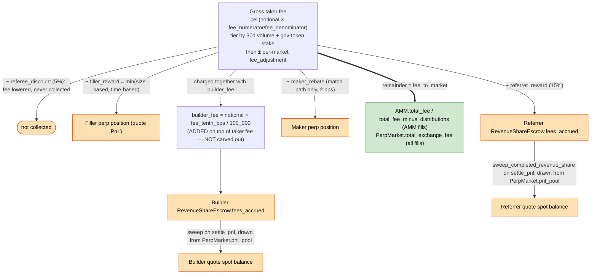

# Drift Protocol v2 — Architecture

Navigation map for `programs/drift` and `sdk/`. Start here to find the right file for any query.

---

## Module Responsibility Matrix

| Module | Owns | Does NOT own |
|---|---|---|
| `programs/drift/src/instructions/` | Account constraint structs, Anchor deserialization, input validation, delegation to `controller` | Business logic, math |
| `programs/drift/src/controller/` | Stateful mutations: fills, liquidations, position updates, funding | Account loading (done by `instructions`), pure math |
| `programs/drift/src/math/` | Pure numeric functions: margin, fees, funding, AMM pricing, oracle checks | Any account I/O or state mutation |
| `programs/drift/src/state/` | Account struct definitions and accessor/mutation methods | Instruction routing, math |
| `programs/drift/src/validation/` | Pre-mutation precondition checks (called by `instructions` before `controller`) | Post-trade checks (those live in `math/margin`) |

---

## Execution Flows

### Place Perp Order
1. User calls `place_perp_order` → `instructions/user.rs` (`PlacePerpOrder` context)
2. → `validation::order::validate_order` (`validation/order.rs`)
3. → `controller::orders::place_perp_order` (`controller/orders.rs`)
4. → `math::orders::standardize_base_asset_amount` + auction parameter derivation
5. → `state::user::add_order` writes order to `User` account

### Fill Perp Order (keeper crank)
1. Keeper calls `fill_perp_order` → `instructions/keeper.rs` (`FillPerpOrder` context)
2. → `controller::orders::fill_perp_order` (`controller/orders.rs`)
3. → `math::margin::calculate_margin_requirement` (pre-fill margin check)
4. → `controller::orders::fulfill_perp_order_with_match` (maker matching loop)
5. → `controller::position::update_position_and_market` (`controller/position.rs`)
6. → `controller::orders::update_order_after_fill` + bookkeeping
7. → emits `OrderActionRecord` event (`state/events.rs`)

### Liquidate Perp
1. Keeper calls `liquidate_perp` → `instructions/keeper.rs`
2. → `controller::liquidation::liquidate_perp` (`controller/liquidation.rs`)
3. → `math::margin::calculate_margin_requirement` (confirms liquidatable)
4. → `math::liquidation::calculate_perp_liquidation_price` + fee
5. → `controller::position::update_position_and_market`
6. → emits `LiquidationRecord`

### Settle PnL
1. Keeper calls `settle_pnl` → `instructions/keeper.rs`
2. → `controller::pnl::settle_funding_payment` (`controller/pnl.rs`)
3. → `math::pnl::calculate_per_lp_position`
4. → mutates `PerpMarket.pnl_pool` and `User` position

### Update Funding Rate
1. Keeper calls `update_funding_rate` → `instructions/keeper.rs`
2. → `controller::funding::update_funding_rate` (`controller/funding.rs`)
3. → `math::funding::calculate_funding_rate` (TWAP-based)
4. → writes `PerpMarket.amm.last_funding_rate`

---

## Fee & Revenue Flow

This section maps every fee the protocol charges, where it goes, and — critically — which flows are **protocol-retained revenue** vs **pass-throughs** (paid straight back out to a user/keeper/builder) vs **liability-offsetting** (insurance-fund inflows that pre-fund bankruptcy payouts). It reflects the post-relaunch (Velocity) codebase, which differs materially from upstream Drift.

### Fork-specific facts that change the picture

- **Spot trading produces no fee revenue.** The swap fee is hardcoded `let fee = 0_u64;` (`instructions/user.rs:3949`). There is no spot order-book fill path in this fork (`fulfill_spot_order` does not exist); spot trades go through `begin_swap`/`end_swap` and `lp_pool_swap`. Consequently `SpotMarket.total_spot_fee`, `spot_fee_pool`, and `total_swap_fee` are **dead/zeroed fields** — ignore them when accounting revenue.
- **Perp taker fees are the only trading-fee revenue.**
- **The protocol already keeps only ½ of net perp fees.** `SHARE_OF_FEES_ALLOCATED_TO_DRIFT = 1/2` (`math/constants.rs:111-112`); the other half is an AMM/PnL buffer.
- **The AMM moved into `src/vlp/`** (VLP = the decoupled AMM, rebranded DLP). AMM fee counters (`total_fee`, `total_mm_fee`, `total_fee_minus_distributions`, `total_fee_withdrawn`, `fee_pool`) now live on `vlp/amm/state.rs`, **not** `PerpMarket`. `lp_fee_transfer_scalar` was relocated to `HedgeConfig.fee_transfer_scalar` (`vlp/hedge/state.rs:80`).

### Diagram 1 — Perp taker-fee decomposition (per fill)

The carve-out order, all in `math/fees.rs` (`calculate_fee_for_fulfillment_with_amm` ~:36-142, `_with_match` ~:263-332):



Only the bold `fee_to_market` path (green) is candidate protocol revenue; everything else (orange) is a pass-through to a user/keeper/builder. **`builder_fee` is additive** — it does not reduce `fee_to_market`, and it is funded out of the perp `pnl_pool` at settle time, so it is a pure pass-through to the builder.

### Diagram 2 — Pool movement map (where value lives and moves)

No value moves directly from a source to a destination — every flow passes through an **accounting ledger** (gray; tracks an amount, holds no tokens), one or more **token pools** (blue; actual claims/balances), and a **settlement step** (orange hexagon; the instruction that moves tokens). The diagram makes all three explicit; the tables below classify every one.

**Node legend:** gray = accounting ledger (no tokens) · blue = token pool · orange hexagon = settlement instruction · green = protocol-retained · light-orange = pass-through · red = liability/outflow. Solid arrow `==>`/`-->` = token movement; dashed arrow `-.->` = a ledger that *gates the amount* of a settlement (not a token move).

```mermaid
flowchart LR
    classDef ledger fill:#eceff1,stroke:#607d8b,color:#000;
    classDef pool fill:#e3f2fd,stroke:#1565c0,color:#000;
    classDef step fill:#fff3e0,stroke:#ef6c00,color:#000;
    classDef revenue fill:#cfe8cf,stroke:#2e7d32,color:#000;
    classDef passthru fill:#ffe0b2,stroke:#e65100,color:#000;
    classDef liability fill:#f8d7da,stroke:#c62828,color:#000;

    TK["Perp taker"]
    BR["Spot borrower"]
    PLQ["Perp liquidatee"]
    SLQ["Spot liquidatee"]

    TEF["total_exchange_fee +<br/>AMM.total_fee / total_fee_minus_distributions / total_fee_withdrawn"]:::ledger
    TLF["PerpMarket.total_liquidation_fee"]:::ledger
    ESC["RevenueShareEscrow.fees_accrued"]:::ledger
    QOL["AmmCache.quote_owed_from_lp_pool"]:::ledger

    FP["AMM.fee_pool"]:::pool
    PP["PerpMarket.pnl_pool"]:::pool
    RP["SpotMarket.revenue_pool (Deposit)"]:::pool
    IFV["Insurance Fund vault"]:::pool
    LPV["LP quote constituent vault"]:::pool

    S_FILL{{"fulfill_perp_order"}}:::step
    S_INT{{"update_spot_market_cumulative_interest"}}:::step
    S_SET{{"settle_pnl → update_pool_balances<br/>→ transfer_revenue_to_pool"}}:::step
    S_REV{{"settle_revenue_to_insurance_fund"}}:::step
    S_SWP{{"settle_pnl → sweep_completed_revenue_share"}}:::step
    S_LP{{"update_amm_cache + SettleAmmPnlToLp"}}:::step
    S_WD{{"admin_withdraw_from_insurance_fund_vault"}}:::step
    S_BK{{"resolve_perp / spot_bankruptcy"}}:::step

    COLD["External protocol wallet"]:::revenue
    BLD["Builder / referrer spot balance"]:::passthru
    LIQ["Liquidator"]:::passthru
    LPH["LP token holders"]:::passthru
    STK["Staker IF claim"]:::passthru
    BD["Bankruptcy bad debt"]:::liability

    %% perp trading fee
    TK --> S_FILL
    S_FILL -->|"+= user_fee (gross)"| TEF
    S_FILL -->|"builder/referrer carve"| ESC
    S_FILL -.->|"hedge settle realizes AMM PnL+fees as tokens"| FP

    %% builder/referrer pass-through
    ESC --> S_SWP
    PP --> S_SWP
    S_SWP -->|"transfer_spot_balances out of pnl_pool"| BLD

    %% lending skim
    BR --> S_INT
    S_INT -->|"deposit_interest × total_factor / 1e6"| RP

    %% liquidations
    PLQ -->|"liquidator_fee (symmetric transfer)"| LIQ
    PLQ -->|"if_fee accrues"| TLF
    SLQ -->|"if_fee → update_revenue_pool_balances (direct)"| RP

    %% shared revenue-pool sweep
    TEF -.->|"½ floor gates amount"| S_SET
    TLF -.->|"min(·, quote_settled + quote_max_insurance) gates"| S_SET
    FP ==>|"reclassify Borrow→Deposit; only if surplus > 250Q,<br/>capped by fee_pool−250Q & period cap"| S_SET
    S_SET ==> RP

    %% revenue → IF → protocol
    RP ==>|"reclassify Borrow + SPL transfer spot_vault→IF_vault"| S_REV
    S_REV ==> IFV
    IFV ==>|"protocol shares = total_shares − user_shares"| S_WD
    S_WD ==>|"cold_admin only, must leave ≥1 share"| COLD
    IFV -->|"user_factor slice raises staker claim"| STK
    IFV -.-> S_BK
    S_BK -.->|"SPL payout → pnl_pool / spot_vault; residual socialized"| BD

    %% LP routing
    TEF -.->|"fee_transfer_scalar % gates"| S_LP
    FP --> S_LP
    PP --> S_LP
    S_LP -->|"accrues, then settles to vault"| QOL
    QOL --> LPV
    LPV --> LPH
```



**The only real cash exit for the protocol** is the chain `fee_pool → revenue_pool → IF vault → protocol IF shares → cold_admin wallet` via `admin_withdraw_from_insurance_fund_vault` (`if_staker.rs:1241`, gated to `state.cold_admin`, must leave ≥1 protocol share). `revenue_pool` itself has no admin→wallet withdraw; its only exits are settling to the IF (`settle_revenue_to_insurance_fund`) or covering an underwater perp market (`update_pool_balances` negative branch — which is currently a no-op at `perp_pools.rs:179`).

### Intermediary pools & ledgers — classification

| Node | Kind | Holds tokens? | Role / classification |
|---|---|---|---|
| `total_exchange_fee`, `AMM.total_fee`, `total_fee_minus_distributions`, `total_fee_withdrawn` | Accounting ledger | No | Gate the revenue-pool sweep (protocol's ½ floor); `total_fee_withdrawn` = realized-revenue meter |
| `PerpMarket.total_liquidation_fee` | Accounting accumulator | No | Gates how much liq-fee may sweep, capped by `quote_max_insurance` |
| `RevenueShareEscrow.fees_accrued` | Accounting ledger | No | Builder/referrer amount owed; paid from `pnl_pool` |
| `AmmCache.quote_owed_from_lp_pool` | Accounting accumulator | No | Perp↔LP amount owed; settled by `SettleAmmPnlToLp` |
| `InsuranceFund.total_shares` / `user_shares` | Share ledger | No | Claims on IF vault; protocol = `total − user` |
| `AMM.fee_pool` | Token pool | Yes | AMM/protocol buffer; **source** of revenue-pool sweeps; funded by hedge settle |
| `PerpMarket.pnl_pool` | Token pool | Yes | Backs user PnL; **source** of builder/referrer sweeps; tapped in perp bankruptcy |
| `SpotMarket.revenue_pool` | Token pool (Deposit) | Yes | **Protocol-revenue staging**; exits only to IF or underwater perp |
| `Insurance Fund vault` | Token pool | Yes | **At-risk**: protocol + staker claims; pays bankruptcies |
| `LP quote constituent vault` | Token pool | Yes | LP-holder owned (not protocol) |

### Settlement steps — per-flow chains

Each row is the full chain `source → ledger → token pool(s) → settlement step(s) → destination`. "→IF→cold" abbreviates the shared tail `revenue_pool —settle_revenue_to_insurance_fund→ IF vault —admin_withdraw_from_insurance_fund_vault (cold_admin)→ wallet`.

| Flow | Ledger(s) | Intermediary token pool(s) | Settlement step(s) | Destination | Class |
|---|---|---|---|---|---|
| Perp trading fee (protocol ½) | `total_exchange_fee`, `AMM.total_fee*` | `fee_pool` → `revenue_pool` → IF vault | `fulfill_perp_order` → (hedge settle funds `fee_pool`) → `update_pool_balances`/`transfer_revenue_to_pool` → →IF→cold | Protocol IF shares → wallet | **Protocol revenue** |
| Lending skim | `total_factor` (vs `cumulative_deposit_interest`) | `revenue_pool` → IF vault | `update_spot_market_cumulative_interest` → →IF→cold | Protocol IF shares → wallet (staker slice via `user_factor`) | **Protocol revenue** (shared) |
| Perp `if_liquidation_fee` | `total_liquidation_fee` | (retained in market) → `fee_pool` → `revenue_pool` → IF vault | `liquidate_perp` (accrue) → `update_pool_balances`/`transfer_revenue_to_pool` (cap `quote_max_insurance`) → `settle_revenue_to_insurance_fund` | IF vault | Liability-offset |
| Spot `if_liquidation_fee` | — (direct write) | liability `revenue_pool` → IF vault | `liquidate_spot`→`update_revenue_pool_balances` → `settle_revenue_to_insurance_fund` | IF vault | Liability-offset |
| Builder fee / referrer reward | `RevenueShareEscrow.fees_accrued` | `pnl_pool` | `fulfill_perp_order` (accrue) → `settle_pnl`/`sweep_completed_revenue_share` | Builder/referrer spot balance | Pass-through |
| Filler reward | — | — (credited to filler `PerpPosition` at fill) | `fulfill_perp_order` | Keeper | Pass-through |
| Maker rebate | `UserStats.total_rebate` | — (credited to maker `PerpPosition`) | `fulfill_perp_order` | Maker | Pass-through |
| Perp `liquidator_fee` | — | — (symmetric quote transfer) | `liquidate_perp` | Liquidator | Pass-through |
| Spot `liquidator_fee` | — | — (asset/liability multiplier spread) | `liquidate_spot` | Liquidator | Pass-through |
| Referee discount | `UserStats.total_referee_discount` | — | — (taker fee reduced) | n/a | Not collected |
| AMM → LP routing | `quote_owed_from_lp_pool` (gated by `fee_transfer_scalar`, `exchange_fee_exclusion_scalar`) | `fee_pool`/`pnl_pool` ↔ LP constituent vault | `update_amm_cache` (accrue) → `SettleAmmPnlToLp` | LP token holders | LP revenue |
| LP swap / mint / redeem fees | `total_swap_fees`, `total_mint_redeem_fees_paid` | LP constituent vaults (stay) | `lp_pool_swap` / `add`/`remove_liquidity` | LP token holders | LP revenue |
| Bankruptcy payout (outflow) | `quote_settled_insurance`, `total_social_loss` | IF vault → `pnl_pool` / `spot_market_vault` | `resolve_perp`/`spot_bankruptcy` (+ socialize residual via `cumulative_funding_rate` / `cumulative_deposit_interest`) | Bad debt | Liability |

### Classification table

| Flow | On-chain field / instruction | Class |
|---|---|---|
| Perp taker fee (gross) | `PerpMarket.total_exchange_fee`, `UserStats.total_fees` | Gross revenue |
| `fee_to_market` (net of filler/referrer/referee/maker) | `AMM.total_fee`, `total_fee_minus_distributions` | Net trading fee (½ retained) |
| AMM spread surplus | `AMM.total_mm_fee` | Included in `total_fee` |
| Protocol share settled to revenue pool | `AMM.total_fee_withdrawn` (realized meter); `transfer_revenue_to_pool` | **Protocol revenue** |
| Lending: `total_factor` skim of borrow interest | `controller/spot_balance.rs:147-171` → `revenue_pool` | **Protocol revenue** (shared w/ stakers at settle) |
| Protocol IF shares | `total_shares − user_shares`; `admin_withdraw_from_insurance_fund_vault` | **Protocol revenue (withdrawable, at-risk)** |
| Maker rebate | `UserStats.total_rebate` | Pass-through (to maker) |
| Referrer reward (15%) | `RevenueShareEscrow` → `RevenueShare.total_referrer_rewards` | Pass-through (to referrer) |
| Referee discount (5%) | `UserStats.total_referee_discount` | Not collected (fee reduction) |
| Filler/keeper reward | filler `PerpPosition` quote PnL | Pass-through (to keeper) |
| Builder fee (additive) | `RevenueShareEscrow` → `RevenueShare.total_builder_rewards` | Pass-through (to builder) |
| Perp `liquidator_fee` | symmetric quote transfer user→liquidator | Pass-through (to liquidator) |
| Perp/spot `if_liquidation_fee` | `total_liquidation_fee` / `revenue_pool` | Liability-offset (IF pre-funds bankruptcies) |
| LP `fee_transfer_scalar` slice, swap fees, mint/redeem fees | `LPPool` / `Constituent` (`vlp/hedge/state.rs`) | LP-holder revenue |
| Staker IF shares | `InsuranceFund.user_shares` | Staker-owned liability |
| User-init rent | `State.max_initialize_user_fee` | Solana rent, not revenue |

### Lending / insurance-fund mechanics (the subtle part)

- **`total_factor` is a skim, not just passive yield.** In `update_spot_market_cumulative_interest` (`controller/spot_balance.rs:130-185`), `deposit_interest_for_stakers = deposit_interest × total_factor / 1e6` is split off the top and deposited into `revenue_pool`; only `deposit_interest − that` is compounded to lenders. So the prior framing ("revenue pool just earns lend yield like any depositor") captures a *second, smaller* effect (the revenue_pool balance is a `Deposit` and does earn the lender rate), but the **primary** lending revenue is the `total_factor` skim on borrower interest.
- **`total_factor` vs `user_factor` at settle** (`controller/insurance.rs:758-775`): when `revenue_pool` settles to the IF, the protocol's slice is `(total_factor − user_factor)/total_factor`, minted as **new IF shares to `total_shares` only** → grows protocol's claim. The `user_factor` portion instead raises existing stakers' share value. So `total_factor` = total fraction of interest routed to the IF; `user_factor` = the sub-fraction that benefits stakers; the gap is the protocol's own accrual.
- **The IF is a two-way book.** `resolve_perp_bankruptcy` (`liquidation.rs:3268`) and `resolve_spot_bankruptcy` (`liquidation.rs:3491`) make real SPL payouts from the IF vault — the transfer is `send_from_program_vault` in the keeper handlers (`keeper.rs` ~`:2026` spot, ~`:2155` perp). So liquidation `if_fee`s and the protocol's IF shares are *at-risk capital* that absorbs bad debt before being withdrawable — not clean P&L.

### Defining "net trading fees" and the recovery-pool number

For a dashboard, the chain of definitions and their **source of truth**:

1. **Gross taker fees (perp).** Per-user lifetime: `UserStats.total_fees`. Per-market: `PerpMarket.total_exchange_fee` — **but caveat:** this field adds gross `user_fee` on AMM-house fills (`orders.rs:2267`) yet net `fee_to_market` on DLOB-matched fills (`orders.rs:2577`), so it is *not* a clean gross meter. Spot contributes **0**.
2. **Deductions / pass-throughs.** maker rebate (`UserStats.total_rebate`), referrer reward (`RevenueShare.total_referrer_rewards`), referee discount (`UserStats.total_referee_discount`), filler reward (no single accumulator — derive from `OrderActionRecord.filler_reward` events), builder fee (`RevenueShare.total_builder_rewards`).
3. **Net trading fees = `fee_to_market`** (the remainder after filler + referrer [+ maker in match path]; referee discount already removed upstream; builder fee never included). The closest single account field is **`AMM.total_fee`** — but it only captures AMM-house fills; pure DLOB-matched fills land in `total_exchange_fee` and skip `apply_fill_fees`. **No single on-chain field cleanly equals "net trading fees" across both fill types** — the reliable source of truth is event-based accounting off `OrderActionRecord` (sum `taker_fee − maker_rebate − referrer_reward − filler_reward`, excluding the builder portion bundled into `taker_fee`).
4. **What the protocol actually retains today is ½ of net** (`SHARE_OF_FEES_ALLOCATED_TO_DRIFT`), realized as growth in `AMM.total_fee_withdrawn` when it settles to `revenue_pool`. So a "75% of net trading fees" recovery allocation is **not** the same basis as the existing 50/50 protocol/AMM split — it would need to be defined as a new carve and reconciled against that split. **This number is not defined in code; it must be specified before it can be implemented or dashboarded.**

> Open question to resolve with the team: is the recovery pool meant to take 75% of **gross taker fees**, of **net-of-pass-through fees**, or of the **protocol's ½ retained share**? Each is a different field set above, and they differ by ~2-4x.

### Verified citation index

Every claim in this section, with the exact symbol + line to search. Verified against the working tree on branch `feat/builder-codes-non-swift` (line numbers drift with edits — search the function name if a number is stale).

**Constants** (`programs/drift/src/math/constants.rs`)
| Constant | Value | Line |
|---|---|---|
| `FEE_DENOMINATOR` | `10 * ONE_BPS_DENOMINATOR` = 100_000 | `:158` (`ONE_BPS_DENOMINATOR`=10000 `:155`) |
| `FEE_PERCENTAGE_DENOMINATOR` | 100 | `:159` |
| `SHARE_OF_FEES_ALLOCATED_TO_DRIFT_NUMERATOR/DENOMINATOR` | 1 / 2 | `:111-112` |
| `SHARE_OF_REVENUE_ALLOCATED_TO_INSURANCE_FUND_VAULT_*` | 1 / 1 | `:117-118` |
| `FEE_POOL_TO_REVENUE_POOL_THRESHOLD` | `TWO_HUNDRED_FIFTY_QUOTE` (250 QUOTE) | `:152` (`:143`) |
| `LIQUIDATION_FEE_PRECISION` | `PERCENTAGE_PRECISION` = 1e6 | `:74` |

**Trading fee math** (`programs/drift/src/math/fees.rs`)
| Claim | Symbol | Line |
|---|---|---|
| Fee tiers / defaults (tier0 fee_num 100=10bps, rebate 20=2bps, referrer 15/100, referee 5/100; lowest 50=5bps) | `FeeStructure::perps_default` | `state/state.rs:461` |
| Tier selection (30d volume + gov stake) | `determine_user_fee_tier` | `:334` (called from `:49`) |
| AMM-fill fee fn; **post-only branch** sets `user_fee=0`, `referrer_reward=0`, `referee_discount=0` | `calculate_fee_for_fulfillment_with_amm` | `:36` (post-only `:52-90`) |
| `fee_to_market = fee − filler − referrer (+ surplus)` | (taker branch) | `:112-116` |
| `builder_fee = quote × fee_tenth_bps / 100_000` (additive, off notional) | (taker branch) | `:120-128` |
| Taker fee = `ceil(notional × fee_num/fee_den)` then `± fee_adjustment` | `calculate_taker_fee` | `:144` |
| Maker rebate (2 bps) | `calculate_maker_rebate` | `:172` |
| Referrer 15% / referee 5% | `calculate_referee_fee_and_referrer_reward` | `:200` |
| DLOB-match fee fn | `calculate_fee_for_fulfillment_with_match` | `:263` |

**Fill accrual / payout** (`programs/drift/src/controller/orders.rs`)
| Claim | Line |
|---|---|
| AMM path: `total_exchange_fee += user_fee` (gross) | `:2267` |
| AMM path: `apply_fill_fees(amm, fee_to_market, surplus)` | `:2268` |
| AMM path: builder `fees_accrued +=` / referrer `fees_accrued +=` | `:2250` / `:2280` |
| AMM path: filler reward → filler position | `credit_filler_perp_pnl` `:2304` |
| Match path: `total_exchange_fee += fee_to_market` (net) — **no `apply_fill_fees`** | `:2577` |
| Match path: taker debited `-(taker_fee + builder_fee)` | `:2580` |
| Match path: `maker_rebate` → maker position; filler → filler; referrer → escrow | `:2587` / `:2599` / `:2622` |

**AMM accounting & revenue sweep** (`programs/drift/src/vlp/...`)
| Claim | Symbol | Line |
|---|---|---|
| AMM fee fields | `fee_pool`/`total_fee`/`total_mm_fee`/`total_fee_minus_distributions`/`total_fee_withdrawn`/`net_revenue_since_last_funding` | `amm/state.rs:82/113/116/119/122/141` |
| `apply_fill_fees`: `total_fee += fee_to_maker`, `total_mm_fee += surplus` | `amm/quoter.rs` | `:170` |
| `transfer_revenue_to_pool` (reclassify fee_pool Borrow → revenue_pool Deposit) | `amm/quoter.rs` | `:177` |
| `fee_pool` funded with tokens ONLY here (+ admin) | `deposit_to_fee_pool` caller | `hedge/math.rs:197` |
| protocol floor = `total_fee × ½ − total_fee_withdrawn` | `total_fee_lower_bound` / `protocol_floor` | `amm/state.rs:358` / `:376` |
| `transfer = (protocol_floor + liq_fees − withdrawn).max(0).min(fee_pool_thresh).min(cap)` | `proposed_revenue_outflow` | `amm/state.rs:409` |
| `get_total_fee_lower_bound = total_exchange_fee × ½` | — | `amm/math/repeg.rs:433` |

**Pool plumbing** (`programs/drift/src/controller/perp_pools.rs`)
| Claim | Symbol | Line |
|---|---|---|
| Revenue-pool transfer decision; runs only if `terminal_state_surplus > 250 QUOTE` | `calculate_revenue_pool_transfer` | `:33` (gate `:47-50`) |
| `total_liq_fees = min(total_liquidation_fee, quote_settled + quote_max_insurance)` | — | `:59-68` |
| Executes the transfer; **negative (revenue→perp) branch is a no-op** | `update_pool_balances` | `:133` (no-op `:179`) |
| Called from settle_pnl | — | `controller/pnl.rs:264` |

**Liquidation** (`programs/drift/src/...`)
| Claim | Symbol | Line |
|---|---|---|
| Perp `liquidator_fee` / `if_fee` = `base_value × fee / 1e6` | `liquidate_perp` | `controller/liquidation.rs:459-469` |
| Perp: user pays `if_fee` (no liquidator credit); `total_liquidation_fee += if_fee` | — | `:502` / `:537` |
| Perp IF-fee rate = `min(if_liquidation_fee, (margin_ratio − liquidator_fee − shortage) × 19/20)` | `calculate_perp_if_fee` | `math/liquidation.rs:394` |
| Spot IF-fee → **direct** `update_revenue_pool_balances(if_fee, Deposit, liability_market)` | `liquidate_spot` / `_with_swap` | `controller/liquidation.rs:1653` / `:2231` |
| Spot IF-fee rate | `calculate_spot_if_fee` | `math/liquidation.rs:438` |
| Perp bankruptcy: `if_payment` → `fee_pool` draw → socialize via `cumulative_funding_rate_long/short` | `resolve_perp_bankruptcy` | `:3268` (if_payment `:3346`, fee_pool `:3407`, socialize `:3435-3440`) |
| Spot bankruptcy: `if_payment` → socialize via `cumulative_deposit_interest` | `resolve_spot_bankruptcy` | `:3491` (if_payment `:3574`, socialize `:3578`) |
| IF-vault SPL payout | `send_from_program_vault` (keeper handlers) | `keeper.rs` ~`:2026` spot / ~`:2155` perp |

**Revenue pool, lending skim, insurance fund**
| Claim | Symbol | Line |
|---|---|---|
| `revenue_pool` is a `PoolBalance` whose `balance_type()` is hardcoded `Deposit`; can't change | `impl SpotBalance for PoolBalance` | `state/perp_market.rs:1094` (`update_balance_type` errs `:1112`) |
| Revenue-pool mutation entrypoint | `update_revenue_pool_balances` | `controller/spot_balance.rs:192` |
| Lending skim: `deposit_interest_for_stakers = deposit_interest × total_factor / 1e6`; only lender share compounds; staker share → revenue_pool | `update_spot_market_cumulative_interest` | `spot_balance.rs:130` (`:147` / `:151` / `:168`) |
| Revenue → IF settlement (100% eligible, period/APR capped) | `settle_revenue_to_insurance_fund` | `controller/insurance.rs:685` |
| Protocol slice = `if_amount × (total_factor − user_factor)/total_factor` minted to `total_shares` only | `protocol_if_factor` | `insurance.rs:758` (mint `:764-775`) |
| Protocol withdraw: `cold_admin` only, must leave ≥1 protocol share | `handle_admin_withdraw_from_insurance_fund_vault` | `instructions/if_staker.rs:1241` (guard `:1281`, `cold_admin` `:1347`) |

**LP / VLP pool** (`programs/drift/src/vlp/...`)
| Claim | Symbol | Line |
|---|---|---|
| Perp→LP routing scalars | `HedgeConfig.fee_transfer_scalar` / `exchange_fee_exclusion_scalar` | `hedge/state.rs:80` / `:78` |
| Routing accrual into `quote_owed_from_lp_pool` | `update_amount_owed_from_lp_pool` | `amm_cache.rs:308` (field `:50`, uses scalar `:351`) |
| Token settlement perp↔LP | `SettleAmmPnlToLp` (`SettlementDirection::To/FromLpPool`) | `hedge/settle.rs:36` (`:158-186`) |
| Constituent swap fee bounds 0.3%–37.5% | `BASE_SWAP_FEE` / `MAX_SWAP_FEE` | `hedge/state.rs:37` / `:38` |
| Mint/redeem fee + counter | `min_mint_fee` / `total_mint_redeem_fees_paid` | `hedge/state.rs:133` / `:118` |

**Spot fees are dead in this fork**
| Claim | Symbol | Line |
|---|---|---|
| Swap fee hardcoded zero | `let fee = 0_u64;` | `instructions/user.rs:3949` |

---

## Account Type Locations

| Type | File | Notes |
|---|---|---|
| `User` | `state/user.rs` | Zero-copy, `AccountLoader`. Holds positions, open orders, margin info. |
| `UserStats` | `state/user.rs` | Companion to `User`, tracks volume/fees/referrals. |
| `PerpMarket` | `state/perp_market.rs` | Zero-copy. Embeds `AMM` struct for AMM state. |
| `SpotMarket` | `state/spot_market.rs` | Zero-copy. Tracks deposits/borrows, oracle, insurance. |
| `State` | `state/state.rs` | Global protocol config: fees, admin pubkey, number of markets. |
| `InsuranceFundStake` | `state/insurance_fund_stake.rs` | Per-user IF stake position. |
| `OracleMap` | `state/oracle_map.rs` | Per-instruction oracle account loader, built from `remaining_accounts`. |
| `OrderParams` | `state/order_params.rs` | Shared input struct for place/modify order instructions. |
| All events | `state/events.rs` | `OrderActionRecord`, `DepositRecord`, `LiquidationRecord`, `FundingPaymentRecord`, etc. |

---

## Key Design Patterns

### Custom High-Frequency Entrypoint
Keeper instructions (`fill_perp_order`, `update_funding_rate`, etc.) use a custom native entrypoint with discriminator `[0xFF, 0xFF, 0xFF, 0xFF, opcode]` that bypasses Anchor's account deserialization overhead. Standard user and admin instructions use the normal Anchor `#[program]` entrypoint.

### `remaining_accounts` Convention
Variable-length account lists are passed via `remaining_accounts` to avoid fixed Anchor context sizes:
- **Oracles**: one oracle account per market referenced in the instruction
- **Spot markets**: for instructions touching multiple spot positions
- **Maker accounts**: `(User, UserStats)` pairs for each DLOB maker in a fill
- **Referrer**: optional `(User, UserStats)` pair at the end of remaining_accounts

### Zero-Copy Account Loading
`User`, `PerpMarket`, and `SpotMarket` are loaded via `AccountLoader<'info, T>` (zero-copy). Call `.load()`/`.load_mut()` rather than direct deserialization. This avoids stack overflow on large structs.

### Feature Flags
| Flag | Purpose |
|---|---|
| `mainnet-beta` | Production gates (program IDs, conservative limits) |
| `anchor-test` | Enables test helper instructions used by TS integration tests |
| `no-entrypoint` | Excludes native entrypoint (for use as CPI dependency) |
| `cpi` | Exposes CPI client only (implies `no-entrypoint`) |

---

## SDK Structure (`sdk/src/`)

### Key Files
| File | Size | Purpose |
|---|---|---|
| `driftClient.ts` | ~13k lines | Main client. All trading + keeper instruction builders. |
| `adminClient.ts` | ~6.5k lines | Admin instruction builders (extends `DriftClient`). |
| `user.ts` | ~4.7k lines | `User` account abstraction: margin queries, position accessors, PnL. |
| `types.ts` | ~45k lines | All shared TypeScript types mirroring on-chain structs. |
| `idl/drift.json` | — | Generated Anchor IDL. Source of truth for instruction interfaces and account layouts. **Do not edit manually.** |

### Key Directories
| Directory | Purpose |
|---|---|
| `accounts/` | Account subscription infrastructure: WebSocket, polling, bulk loaders. |
| `addresses/` | `pda.ts` — all PDA derivation helpers. |
| `dlob/` | Decentralized Limit Order Book: order matching, price levels, maker selection. |
| `math/` | TypeScript mirrors of on-chain math (margin, funding, AMM pricing). |
| `oracles/` | Oracle client adapters (Pyth, Switchboard, Pyth Lazer). |
| `events/` | Event parsing and subscription from program logs. |
| `tx/` | Transaction building utilities, compute unit estimation. |
| `constants/` | Market indices, precision constants, numeric limits. |

### SDK ↔ On-Chain Instruction Mapping
| SDK Method | On-Chain Instruction | Handler File |
|---|---|---|
| `driftClient.placePerpOrder` | `PlacePerpOrder` | `instructions/user.rs` |
| `driftClient.cancelOrder` | `CancelOrder` | `instructions/user.rs` |
| `driftClient.modifyOrder` | `ModifyOrder` | `instructions/user.rs` |
| `driftClient.deposit` | `Deposit` | `instructions/user.rs` |
| `driftClient.withdraw` | `Withdraw` | `instructions/user.rs` |
| `driftClient.fillPerpOrder` | `FillPerpOrder` | `instructions/keeper.rs` |
| `driftClient.settlePnl` | `SettlePnl` | `instructions/keeper.rs` |
| `driftClient.liquidatePerp` | `LiquidatePerp` | `instructions/keeper.rs` |
| `driftClient.updateFundingRate` | `UpdateFundingRate` | `instructions/keeper.rs` |
| `adminClient.initializePerpMarket` | `InitializePerpMarket` | `instructions/admin.rs` |
| `adminClient.updatePerpMarket*` | `UpdatePerpMarket*` | `instructions/admin.rs` |
| `adminClient.updateOracleGuardRails` | `UpdateOracleGuardRails` | `instructions/admin.rs` |

---

## Ancillary Programs

These are stubs/wrappers used by Drift for oracle and DEX integrations. No core logic lives here.

| Program | Purpose |
|---|---|
| `programs/pyth/` | Pyth V1 oracle account layout definitions |
| `programs/pyth-lazer/` | Pyth Lazer type definitions and utilities |
| `programs/switchboard/` | Switchboard V2 oracle account type definitions |
| `programs/switchboard-on-demand/` | Switchboard On-Demand oracle type definitions |
| `programs/openbook_v2/` | OpenBook V2 account types for spot fulfillment |
| `programs/token_faucet/` | Devnet/test token minting utility (not on mainnet) |

---

## Build & Test Quick Reference

See `CLAUDE.md` for full commands. Key entry points:

```bash
# Verify program compiles after Rust changes
cargo build -p drift

# Run Rust unit tests
cargo test -p drift

# Run a single TS integration test
ts-mocha -t 300000 ./tests/<test_file>.ts

# Full TS integration suite
bash test-scripts/run-anchor-tests.sh --skip-build
```
