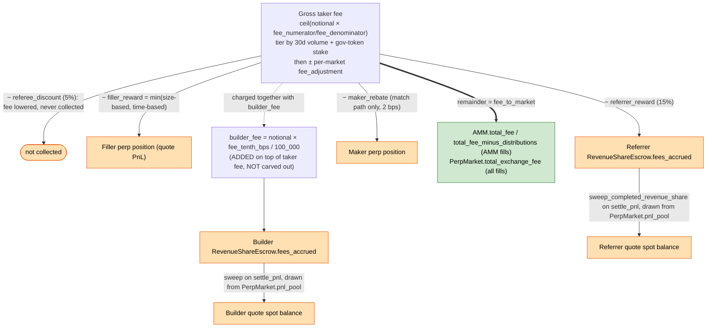
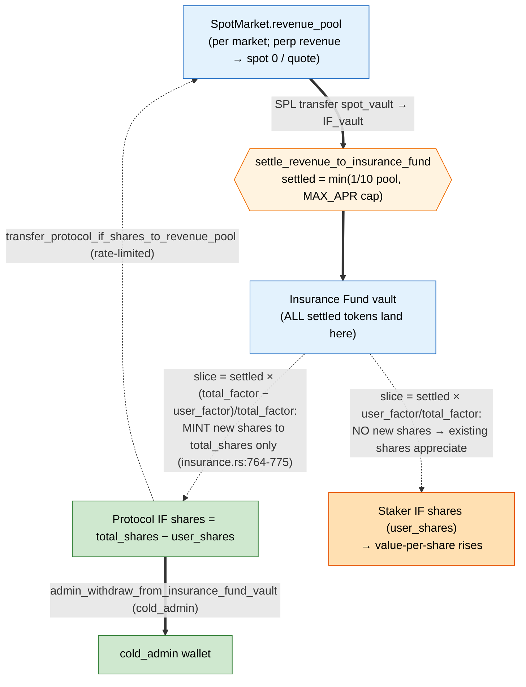

# Fees and revenue: the pre-redesign system (archived)

This is the fee and revenue design Velocity replaced in the June 2026 redesign,
moved out of [FEES.md](./FEES.md) so that document describes only the live
system. It is kept for context on what was replaced and why.

Nothing described here remains onchain. The `total_exchange_fee` halved revenue
sweep, the `total_factor` and `user_factor` settlement split, and protocol-owned
insurance-fund shares are all gone. So are the symbols and line numbers this
document cites: the "Source reference index" at the end points at
`programs/drift/src/...`, a path that does not exist in this repository, and its
line numbers describe code that was deleted. Treat every citation below as a
pointer into history, not into the tree.

For the live system, read [FEES.md](./FEES.md).

---

The old design classified every fee the protocol charged by destination.
Protocol-retained revenue stayed with the protocol. Pass-through fees were
forwarded to a user, keeper, or builder. Liability-offsetting fees were
insurance-fund inflows that pre-funded bankruptcy payouts. LP revenue went to
the LP pool. This fork diverged from upstream Drift in the ways noted below.

## Differences from upstream Drift

- Spot trading charges no fee. The swap fee is hardcoded to zero
  (`let fee = 0_u64;`, `instructions/user.rs:4492`), and there is no spot
  order-book fill path, since `fulfill_spot_order` does not exist. Spot trades
  route through `begin_swap` / `end_swap` and `lp_pool_swap`.
  `SpotMarket.total_spot_fee` and `total_swap_fee` are therefore inert. The
  unused `spot_fee_pool` slot is reserved padding.
- Perp taker fees are the only trading-fee revenue.
- The AMM lives in `src/vlp/`, the decoupled AMM. Its fee counters (`total_fee`,
  `total_mm_fee`, `total_fee_minus_distributions`, `total_fee_withdrawn`,
  `fee_pool`) are on `vlp/amm/state.rs` rather than on `PerpMarket`, and
  `lp_fee_transfer_scalar` is now `HedgeConfig.fee_transfer_scalar`
  (`vlp/hedge/state.rs:80`).
- The protocol's automatic fee share is one half of taker fees
  (`SHARE_OF_FEES_ALLOCATED_TO_DRIFT = 1/2`, `math/constants.rs:111-112`). That
  bounds only the continuous revenue-pool sweep. AMM spread surplus and trading
  PnL are excluded from it and are realized at market wind-down instead, as
  described in [Protocol fee share](#protocol-fee-share-streaming-vs-wind-down).

## Diagram 1: perp taker-fee decomposition

Carve-out order, in `math/fees.rs` (`calculate_fee_for_fulfillment_with_amm`
`:36`, `calculate_fee_for_fulfillment_with_match` `:263`):

`fee_to_market` was the only protocol-retained component, shown in green. The
rest was forwarded to a user, keeper, or builder. `builder_fee` was additive
rather than carved out, so it did not reduce `fee_to_market`, and it was paid
from the perp `pnl_pool` at settlement.

## Diagram 2: value flow across pools

Each flow passed through an accounting ledger, which tracked an amount but held
no tokens, then one or more token pools holding actual balances, then a
settlement instruction that moved tokens.

Legend: gray = accounting ledger, blue = token pool, orange hexagon =
settlement instruction, green = protocol-retained, light-orange =
pass-through, red = liability/outflow. A solid arrow is token movement. A
dashed arrow is a ledger that bounds a settlement amount.

```mermaid
flowchart LR
    classDef ledger fill:#eceff1,stroke:#607d8b,color:#000;
    classDef pool fill:#e3f2fd,stroke:#1565c0,color:#000;
    classDef step fill:#fff3e0,stroke:#ef6c00,color:#000;
    classDef revenue fill:#cfe8cf,stroke:#2e7d32,color:#000;
    classDef passthru fill:#ffe0b2,stroke:#e65100,color:#000;
    classDef liability fill:#f8d7da,stroke:#c62828,color:#000;

    TK["Perp taker"]
    BR["Spot borrower"]
    PLQ["Perp liquidatee"]
    SLQ["Spot liquidatee"]

    TEF["total_exchange_fee +<br/>AMM.total_fee / total_fee_minus_distributions / total_fee_withdrawn"]:::ledger
    TLF["PerpMarket.total_liquidation_fee"]:::ledger
    ESC["RevenueShareEscrow.fees_accrued"]:::ledger
    QOL["AmmCache.quote_owed_from_lp_pool"]:::ledger

    FP["AMM.fee_pool"]:::pool
    PP["PerpMarket.pnl_pool"]:::pool
    RP["SpotMarket.revenue_pool (Deposit)<br/>perp revenue → spot 0 (USDC); spot revenue → own market"]:::pool
    IFV["Insurance Fund vault"]:::pool
    LPV["LP quote constituent vault"]:::pool

    S_FILL{{"fulfill_perp_order"}}:::step
    S_INT{{"update_spot_market_cumulative_interest"}}:::step
    S_SET{{"settle_pnl → update_pool_balances<br/>→ transfer_revenue_to_pool"}}:::step
    S_REV{{"settle_revenue_to_insurance_fund"}}:::step
    S_SWP{{"settle_pnl → sweep_completed_revenue_share"}}:::step
    S_LP{{"update_amm_cache + SettleAmmPnlToLp"}}:::step
    S_WD{{"admin_withdraw_from_insurance_fund_vault"}}:::step
    S_BK{{"resolve_perp / spot_bankruptcy"}}:::step
    S_EXP{{"settle_expired_market_pools_to_revenue_pool<br/>(market Settlement → Delisted)"}}:::step

    COLD["External protocol wallet"]:::revenue
    BLD["Builder / referrer spot balance"]:::passthru
    LIQ["Liquidator"]:::passthru
    LPH["LP token holders"]:::passthru
    STK["Staker IF claim"]:::passthru
    BD["Bankruptcy bad debt"]:::liability

    %% perp trading fee
    TK --> S_FILL
    S_FILL -->|"+= user_fee (gross)"| TEF
    S_FILL -->|"builder/referrer carve"| ESC
    S_FILL -.->|"hedge settle realizes AMM PnL+fees as tokens"| FP

    %% builder/referrer pass-through
    ESC --> S_SWP
    PP --> S_SWP
    S_SWP -->|"transfer_spot_balances out of pnl_pool"| BLD

    %% lending skim
    BR --> S_INT
    S_INT -->|"deposit_interest × total_factor / 1e6"| RP

    %% liquidations
    PLQ -->|"liquidator_fee (symmetric transfer)"| LIQ
    PLQ -->|"if_fee accrues"| TLF
    SLQ -->|"if_fee → update_revenue_pool_balances (direct)"| RP

    %% shared revenue-pool sweep
    TEF -.->|"½ floor gates amount"| S_SET
    TLF -.->|"min(·, quote_settled + quote_max_insurance) gates"| S_SET
    FP ==>|"reclassify Borrow→Deposit; only if surplus > 250Q,<br/>capped by ½×total_exchange_fee (excl. spread/PnL) & period cap"| S_SET
    S_SET ==> RP

    %% wind-down: protocol recovers 100% of residual (NOT capped at ½)
    FP ==>|"on expiry: withdraw_from_fee_pool (100% residual)"| S_EXP
    PP ==>|"on expiry: 100% residual"| S_EXP
    S_EXP ==> RP

    %% revenue → IF → protocol
    RP ==>|"reclassify Borrow + SPL transfer spot_vault→IF_vault"| S_REV
    S_REV ==> IFV
    IFV ==>|"protocol shares = total_shares − user_shares"| S_WD
    S_WD ==>|"cold_admin only, must leave ≥1 share"| COLD
    IFV -->|"user_factor slice raises staker claim"| STK
    IFV -.-> S_BK
    S_BK -.->|"SPL payout → pnl_pool / spot_vault; residual socialized"| BD

    %% LP routing
    TEF -.->|"fee_transfer_scalar % gates"| S_LP
    FP --> S_LP
    PP --> S_LP
    S_LP -->|"accrues, then settles to vault"| QOL
    QOL --> LPV
    LPV --> LPH
```

The protocol had one path to an external wallet. The AMM's `fee_pool` swept
into the `revenue_pool`, the revenue pool settled into the IF vault, the
protocol's IF shares represented its claim on that vault, and `cold_admin`
withdrew against those shares with `admin_withdraw_from_insurance_fund_vault`
(`if_staker.rs:1241`, restricted to `state.cold_admin`, required to leave at
least one protocol share). The `revenue_pool` had no direct admin withdrawal.
It exited only to the IF through `settle_revenue_to_insurance_fund`, or to an
underwater perp market through `update_pool_balances`, whose negative branch
was a no-op (`perp_pools.rs:179`).

## Protocol fee share: streaming vs wind-down

The one-half share bounded the continuous sweep, not the protocol's total claim
on a market's fees.

| Path | When | Amount | Mechanism |
|---|---|---|---|
| Streaming sweep | Continuously, during `settle_pnl` | ≤ `½ × total_exchange_fee + liq_fees` lifetime (`total_fee_withdrawn`) | `proposed_revenue_outflow` (`amm/state.rs:409`); cap `total_fee_for_if = total_exchange_fee × ½` (`perp_pools.rs:81`, `repeg.rs:433`) |
| Fee↔PnL rebalance | Admin | None (internal) | `transfer_fee_and_pnl_pool` (`admin.rs:1141`) moves `fee_pool`↔`pnl_pool`; does not reach the revenue pool |
| Wind-down sweep | Market expired, balanced, after escrow | 100% of residual `fee_pool + pnl_pool` | `settle_expired_market_pools_to_revenue_pool` (`admin.rs:1083`, sweep `:1164-1190`) |

The streaming cap was keyed to `total_exchange_fee`, which accumulated only the
explicit taker fee (`user_fee`, `orders.rs:2267`). AMM spread surplus
(`taker_surplus` into `AMM.total_mm_fee`, `quoter.rs:170`) and AMM trading PnL
accrued to `total_fee` and `total_fee_minus_distributions` and stayed in
`fee_pool` as retained equity, reaching the revenue pool only at delist. Higher
AMM profitability raised `fee_pool` but not the streaming cap.

## Pools and ledgers

| Node | Kind | Holds tokens? | Role / classification |
|---|---|---|---|
| `total_exchange_fee`, `AMM.total_fee`, `total_fee_minus_distributions`, `total_fee_withdrawn` | Accounting ledger | No | Gate the revenue-pool sweep (protocol's ½ floor); `total_fee_withdrawn` = realized-revenue meter |
| `PerpMarket.total_liquidation_fee` | Accounting accumulator | No | Gates how much liq-fee may sweep, capped by `quote_max_insurance` |
| `RevenueShareEscrow.fees_accrued` | Accounting ledger | No | Builder/referrer amount owed; paid from `pnl_pool` |
| `AmmCache.quote_owed_from_lp_pool` | Accounting accumulator | No | Perp↔LP amount owed; settled by `SettleAmmPnlToLp` |
| `InsuranceFund.total_shares` / `user_shares` | Share ledger | No | Claims on IF vault; protocol = `total − user` |
| `AMM.fee_pool` | Token pool | Yes | AMM/protocol buffer; source of revenue-pool sweeps; funded by hedge settle |
| `PerpMarket.pnl_pool` | Token pool | Yes | Backs user PnL; source of builder/referrer sweeps; tapped in perp bankruptcy |
| `SpotMarket.revenue_pool` | Token pool (Deposit) | Yes | Protocol-revenue staging, one per spot market; perp revenue routes to spot 0 (USDC), spot revenue stays in its own market; exits only to IF or underwater perp |
| `Insurance Fund vault` | Token pool | Yes | At-risk capital: one per spot market (perp revenue goes to the USDC IF); protocol + staker claims; pays bankruptcies |
| `LP quote constituent vault` | Token pool | Yes | LP-holder owned (not protocol) |

## Flow classification

Each row below is one chain, from ledger through token pools and settlement
steps to a destination, with its class. `IF-to-cold` is shorthand for the
shared tail that every protocol-revenue chain ended in. The `revenue_pool`
settled into the IF vault through `settle_revenue_to_insurance_fund`, and
`cold_admin` withdrew from the IF vault through
`admin_withdraw_from_insurance_fund_vault`. User-account initialization charged
`State.max_initialize_user_fee`, which is Solana rent rather than revenue.

| Flow | Ledger(s) | Intermediary token pool(s) | Settlement step(s) | Destination | Class |
|---|---|---|---|---|---|
| Perp trading fee (protocol ½, live) | `total_exchange_fee`, `AMM.total_fee*` | `fee_pool` → `revenue_pool` → IF vault | `fulfill_perp_order` → (hedge settle funds `fee_pool`) → `update_pool_balances`/`transfer_revenue_to_pool` → `IF-to-cold` | Protocol IF shares → wallet | Protocol revenue (capped ½×`total_exchange_fee`) |
| AMM spread surplus + trading PnL | `AMM.total_mm_fee`, `total_fee_minus_distributions` | `fee_pool` (retained equity) → `revenue_pool` | accrues live (excluded from sweep cap); realized only via `settle_expired_market_pools_to_revenue_pool` (100% residual) | `IF-to-cold` (at delist) | Protocol revenue, deferred to wind-down |
| Lending skim | `total_factor` (vs `cumulative_deposit_interest`) | `revenue_pool` → IF vault | `update_spot_market_cumulative_interest` → `IF-to-cold` | Protocol IF shares → wallet (staker slice via `user_factor`) | Protocol revenue (shared) |
| Perp `if_liquidation_fee` | `total_liquidation_fee` | (retained in market) → `fee_pool` → `revenue_pool` → IF vault | `liquidate_perp` (accrue) → `update_pool_balances`/`transfer_revenue_to_pool` (cap `quote_max_insurance`) → `settle_revenue_to_insurance_fund` | IF vault | Liability-offset |
| Spot `if_liquidation_fee` | n/a (direct write) | liability `revenue_pool` → IF vault | `liquidate_spot`→`update_revenue_pool_balances` → `settle_revenue_to_insurance_fund` | IF vault | Liability-offset |
| Builder fee / referrer reward | `RevenueShareEscrow.fees_accrued` | `pnl_pool` | `fulfill_perp_order` (accrue) → `settle_pnl`/`sweep_completed_revenue_share` | Builder/referrer spot balance | Pass-through |
| Filler reward | n/a | n/a (credited to filler `PerpPosition` at fill) | `fulfill_perp_order` | Keeper | Pass-through |
| Maker rebate | `UserStats.total_rebate` | n/a (credited to maker `PerpPosition`) | `fulfill_perp_order` | Maker | Pass-through |
| Perp `liquidator_fee` | n/a | n/a (symmetric quote transfer) | `liquidate_perp` | Liquidator | Pass-through |
| Spot `liquidator_fee` | n/a | n/a (asset/liability multiplier spread) | `liquidate_spot` | Liquidator | Pass-through |
| Referee discount | `UserStats.total_referee_discount` | n/a | n/a (taker fee reduced) | n/a | Not collected |
| AMM → LP routing | `quote_owed_from_lp_pool` (gated by `fee_transfer_scalar`, `exchange_fee_exclusion_scalar`) | `fee_pool`/`pnl_pool` ↔ LP constituent vault | `update_amm_cache` (accrue) → `SettleAmmPnlToLp` | LP token holders | LP revenue |
| LP swap / mint / redeem fees | `total_swap_fees`, `total_mint_redeem_fees_paid` | LP constituent vaults (stay) | `lp_pool_swap` / `add`/`remove_liquidity` | LP token holders | LP revenue |
| Bankruptcy payout (outflow) | `quote_settled_insurance`, `total_social_loss` | IF vault → `pnl_pool` / `spot_market_vault` | `resolve_perp`/`spot_bankruptcy` (+ socialize residual via `cumulative_funding_rate` / `cumulative_deposit_interest`) | Bad debt | Liability |

## Lending and insurance-fund revenue

Two per-spot-market knobs drove the old lending and settlement steps:
`total_factor` and `user_factor`, both `u32` at `IF_FACTOR_PRECISION` = 1e6
(`spot_market.rs:681-682`). They were set by `handle_update_spot_market_if_factor`
(`admin.rs:1636`), which required `user_factor ≤ total_factor ≤ 1e6`, and market
init defaulted `user_factor = total_factor / 2` (`admin.rs:384-385`).

The lending skim used `total_factor` alone and fed the revenue pool. In
`update_spot_market_cumulative_interest` (`controller/spot_balance.rs:130-185`),
`total_factor × deposit_interest / 1e6` was split off before lenders were paid
and deposited into that spot market's `revenue_pool`. Only the remainder
compounded into `cumulative_deposit_interest`. The local variable was named
`deposit_interest_for_stakers`, but it used `total_factor` and funded the IF
system as a whole, protocol *and* stakers, not stakers alone. The `revenue_pool`
balance, being a `Deposit`, also passively earned the lender rate, but the skim
was the primary lending revenue.

The settlement split used both factors and moved value out of the revenue pool
into the IF. `settle_revenue_to_insurance_fund`
(`controller/insurance.rs:758-775`) divided the settled amount.
`(total_factor − user_factor)/total_factor` was minted as new protocol shares,
raising `total_shares` only, and `user_factor/total_factor` raised existing
stakers' share value. This split applied to the entire revenue pool regardless
of source, so perp taker fees and liquidation `if_fee`s were commingled with the
lending skim and carved the same way. `total_factor` therefore did double duty
as both the lending-skim rate and, with `user_factor`, the protocol/staker split
ratio for all revenue.

Scoping was per market. Each spot market had its own `revenue_pool`,
`InsuranceFund` (factors, shares, vault), and settlement, and spot
lending/liquidation revenue stayed in *that* market's pool and IF. All perp
revenue routed to spot market 0, the quote market, because every perp's
`quote_spot_market_index` is fixed to `QUOTE_SPOT_MARKET_INDEX = 0`
(`admin.rs:666`, no setter) and `settle_pnl` swept to it via
`get_quote_spot_market_mut()` (`pnl.rs:124`). The quote market's `total_factor`
and `user_factor` therefore governed the protocol/staker split of essentially
all perp-derived revenue.

The book ran both ways. `resolve_perp_bankruptcy` (`liquidation.rs:3268`) and
`resolve_spot_bankruptcy` (`liquidation.rs:3491`) paid out of the IF vault
through `send_from_program_vault` (`keeper.rs` ~`:2026` spot, ~`:2155` perp), so
liquidation `if_fee`s and protocol IF shares absorbed bad debt before they were
withdrawable.

## Insurance-fund staker economics

The IF is a share-based vault. Value accrues as vault-balance growth against a
fixed share count, and there is no per-staker interest field.

- Stake. `add_insurance_fund_stake` (`controller/insurance.rs:83`) minted
  `amount × total_shares / vault_balance` shares (`vault_amount_to_if_shares`,
  `math/insurance.rs:16`) to both `user_shares` and `total_shares`.
- Claim. A staker's claim was `vault_balance × shares / total_shares`
  (`if_shares_to_vault_amount`, `math/insurance.rs:44`).
- Unstake, by request plus cooldown. `request_remove_insurance_fund_stake`
  (`:235`) recorded the share count and value at request. After
  `unstaking_period`, `remove_insurance_fund_stake` (`:385`, cooldown `:396`)
  paid `min(current_value, requested_value)` (`:429`) and burned from both share
  counters. Losses during the cooldown reduced the payout, and gains above the
  requested value were not captured.
- First-loss capital. Bankruptcy payouts shrank the vault and reduced every
  share's value. `apply_rebase_to_insurance_fund` (`:158`) handled a near-zero
  vault.

Two directions existed between the IF and the revenue pool.
`settle_revenue_to_insurance_fund` (`:685`) moved the revenue pool into the IF
vault, throttled to `min(1/10 of revenue pool, MAX_APR cap)` per settle when
stakers existed (`:719-739`), at half rate under high utilization (`:714-717`).
`transfer_protocol_if_shares_to_revenue_pool` (`:1150`) moved the other way,
limited to protocol shares (`:1167`) and to
`IfRebalanceConfig.max_transfer_amount`. Staker capital never flowed to the
revenue pool.

From a staker's perspective, yield was the `user_factor/total_factor` slice of
everything that settled into the IF. That included perp taker fees, liquidation
`if_fee`s, and the lending skim alongside insurance premiums, since all of it
was commingled in the revenue pool. See
[Lending and insurance-fund revenue](#lending-and-insurance-fund-revenue) for
the `total_factor` / `user_factor` mechanics. The protocol took the
complementary `(total_factor − user_factor)/total_factor` as new shares
(`get_protocol_shares = total_shares − user_shares`, `spot_market.rs:686`). Spot
lenders were not stakers. They received only `cumulative_deposit_interest`, net
of the skim, and earned none of these fees.

### Diagram 3: insurance-fund revenue split

The dashed arrows show the factor split of the just-settled tokens, all of
which already sat in the vault. The protocol leg materialized as newly minted
shares, and the staker leg as appreciation of existing shares.

## Gross vs net trading-fee fields

- Gross taker fees (perp) were `UserStats.total_fees` per user and
  `PerpMarket.total_exchange_fee` per market. `total_exchange_fee` accumulated
  gross `user_fee` on AMM fills (`orders.rs:2267`) but net `fee_to_market` on
  DLOB-matched fills (`orders.rs:2577`). Spot contributed zero.
- Deductions were the maker rebate (`UserStats.total_rebate`), referrer reward
  (`RevenueShare.total_referrer_rewards`), referee discount
  (`UserStats.total_referee_discount`), filler reward
  (`OrderActionRecord.filler_reward` events), and builder fee
  (`RevenueShare.total_builder_rewards`).
- The net trading fee was `fee_to_market`, meaning the taker fee minus filler
  and referrer rewards, and minus the maker rebate on the match path. The
  referee discount was removed upstream and the builder fee was excluded.
  `AMM.total_fee` captured this for AMM fills only, since DLOB-matched fills
  accrued to `total_exchange_fee` and skipped `apply_fill_fees`. No single
  field equaled net trading fees across both fill types, so event-level
  aggregation from `OrderActionRecord` was required.
- Protocol-retained revenue was half of net, realized as growth in
  `AMM.total_fee_withdrawn` as it settled to `revenue_pool`. The remainder was
  deferred AMM equity, described in
  [Protocol fee share](#protocol-fee-share-streaming-vs-wind-down).

## Source reference index

Symbol and line for each claim above. These line numbers describe the
pre-redesign code and no longer resolve against the current tree; search the
symbol if you need the modern equivalent.

**Constants** (`programs/drift/src/math/constants.rs`)
| Constant | Value | Line |
|---|---|---|
| `FEE_DENOMINATOR` | `10 * ONE_BPS_DENOMINATOR` = 100_000 | `:158` (`ONE_BPS_DENOMINATOR`=10000 `:155`) |
| `FEE_PERCENTAGE_DENOMINATOR` | 100 | `:159` |
| `SHARE_OF_FEES_ALLOCATED_TO_DRIFT_NUMERATOR/DENOMINATOR` | 1 / 2 | `:111-112` |
| `SHARE_OF_REVENUE_ALLOCATED_TO_INSURANCE_FUND_VAULT_*` | 1 / 1 | `:117-118` |
| `FEE_POOL_TO_REVENUE_POOL_THRESHOLD` | `TWO_HUNDRED_FIFTY_QUOTE` (250 QUOTE) | `:152` (`:143`) |
| `LIQUIDATION_FEE_PRECISION` | `PERCENTAGE_PRECISION` = 1e6 | `:74` |

**Trading fee math** (`programs/drift/src/math/fees.rs`)
| Claim | Symbol | Line |
|---|---|---|
| Fee tiers / defaults (tier0 fee_num 100=10bps, rebate 20=2bps, referrer 15/100, referee 5/100; lowest 50=5bps) | `FeeStructure::perps_default` | `state/state.rs:461` |
| Tier selection (30d volume + gov stake) | `determine_user_fee_tier` | `:334` (called from `:49`) |
| AMM-fill fee fn; post-only branch sets `user_fee=0`, `referrer_reward=0`, `referee_discount=0` | `calculate_fee_for_fulfillment_with_amm` | `:36` (post-only `:52-90`) |
| `fee_to_market = fee − filler − referrer (+ surplus)` | (taker branch) | `:112-116` |
| `builder_fee = quote × fee_tenth_bps / 100_000` (additive, off notional) | (taker branch) | `:120-128` |
| Taker fee = `ceil(notional × fee_num/fee_den)` then `± fee_adjustment` | `calculate_taker_fee` | `:144` |
| Maker rebate (2 bps) | `calculate_maker_rebate` | `:172` |
| Referrer 15% / referee 5% | `calculate_referee_fee_and_referrer_reward` | `:200` |
| DLOB-match fee fn | `calculate_fee_for_fulfillment_with_match` | `:263` |

**Fill accrual / payout** (`programs/drift/src/controller/orders.rs`)
| Claim | Line |
|---|---|
| AMM path: `total_exchange_fee += user_fee` (gross) | `:2267` |
| AMM path: `apply_fill_fees(amm, fee_to_market, surplus)` | `:2268` |
| AMM path: builder `fees_accrued +=` / referrer `fees_accrued +=` | `:2250` / `:2280` |
| AMM path: filler reward → filler position | `credit_filler_perp_pnl` `:2304` |
| Match path: `total_exchange_fee += fee_to_market` (net), no `apply_fill_fees` | `:2577` |
| Match path: taker debited `-(taker_fee + builder_fee)` | `:2580` |
| Match path: `maker_rebate` → maker position; filler → filler; referrer → escrow | `:2587` / `:2599` / `:2622` |

**AMM accounting & revenue sweep** (`programs/drift/src/vlp/...`)
| Claim | Symbol | Line |
|---|---|---|
| AMM fee fields | `fee_pool`/`total_fee`/`total_mm_fee`/`total_fee_minus_distributions`/`total_fee_withdrawn`/`net_revenue_since_last_funding` | `amm/state.rs:82/113/116/119/122/141` |
| `apply_fill_fees`: `total_fee += fee_to_maker`, `total_mm_fee += surplus` | `amm/quoter.rs` | `:170` |
| `transfer_revenue_to_pool` (reclassify fee_pool Borrow → revenue_pool Deposit) | `amm/quoter.rs` | `:177` |
| `fee_pool` funded with tokens ONLY here (+ admin) | `deposit_to_fee_pool` caller | `hedge/math.rs:197` |
| protocol floor = `total_fee × ½ − total_fee_withdrawn` | `total_fee_lower_bound` / `protocol_floor` | `amm/state.rs:358` / `:376` |
| `transfer = (protocol_floor + liq_fees − withdrawn).max(0).min(fee_pool_thresh).min(cap)` | `proposed_revenue_outflow` | `amm/state.rs:409` |
| `get_total_fee_lower_bound = total_exchange_fee × ½` (live sweep cap; excludes spread/PnL) | n/a | `amm/math/repeg.rs:433` |
| Internal fee↔pnl rebalance (no net extraction) | `handle_transfer_fee_and_pnl_pool` | `instructions/admin.rs:1141` (`lib.rs:2042`) |
| Wind-down: 100% of residual `fee_pool + pnl_pool` → revenue pool | `handle_settle_expired_market_pools_to_revenue_pool` | `instructions/admin.rs:1083` (sweep `:1164-1190`, `lib.rs:1032`) |

**Pool plumbing** (`programs/drift/src/controller/perp_pools.rs`)
| Claim | Symbol | Line |
|---|---|---|
| Revenue-pool transfer decision; runs only if `terminal_state_surplus > 250 QUOTE` | `calculate_revenue_pool_transfer` | `:33` (gate `:47-50`) |
| `total_liq_fees = min(total_liquidation_fee, quote_settled + quote_max_insurance)` | n/a | `:59-68` |
| Executes the transfer; negative (revenue→perp) branch is a no-op | `update_pool_balances` | `:133` (no-op `:179`) |
| Called from settle_pnl | n/a | `controller/pnl.rs:264` |

**Liquidation** (`programs/drift/src/...`)
| Claim | Symbol | Line |
|---|---|---|
| Perp `liquidator_fee` / `if_fee` = `base_value × fee / 1e6` | `liquidate_perp` | `controller/liquidation.rs:459-469` |
| Perp: user pays `if_fee` (no liquidator credit); `total_liquidation_fee += if_fee` | n/a | `:502` / `:537` |
| Perp IF-fee rate = `min(if_liquidation_fee, (margin_ratio − liquidator_fee − shortage) × 19/20)` | `calculate_perp_if_fee` | `math/liquidation.rs:394` |
| Spot IF-fee written directly via `update_revenue_pool_balances(if_fee, Deposit, liability_market)` | `liquidate_spot` / `_with_swap` | `controller/liquidation.rs:1653` / `:2231` |
| Spot IF-fee rate | `calculate_spot_if_fee` | `math/liquidation.rs:438` |
| Perp bankruptcy: `if_payment` → `fee_pool` draw → socialize via `cumulative_funding_rate_long/short` | `resolve_perp_bankruptcy` | `:3268` (if_payment `:3346`, fee_pool `:3407`, socialize `:3435-3440`) |
| Spot bankruptcy: `if_payment` → socialize via `cumulative_deposit_interest` | `resolve_spot_bankruptcy` | `:3491` (if_payment `:3574`, socialize `:3578`) |
| IF-vault SPL payout | `send_from_program_vault` (keeper handlers) | `keeper.rs` ~`:2026` spot / ~`:2155` perp |

**Revenue pool, lending skim, insurance fund**
| Claim | Symbol | Line |
|---|---|---|
| `revenue_pool` is a `PoolBalance` whose `balance_type()` is hardcoded `Deposit`; can't change | `impl SpotBalance for PoolBalance` | `state/perp_market.rs:1094` (`update_balance_type` errs `:1112`) |
| Revenue-pool mutation entrypoint | `update_revenue_pool_balances` | `controller/spot_balance.rs:192` |
| Lending skim: `deposit_interest_for_stakers = deposit_interest × total_factor / 1e6`; only lender share compounds; staker share → revenue_pool | `update_spot_market_cumulative_interest` | `spot_balance.rs:130` (`:147` / `:151` / `:168`) |
| Revenue → IF settlement (100% eligible, period/APR capped) | `settle_revenue_to_insurance_fund` | `controller/insurance.rs:685` |
| Protocol slice = `if_amount × (total_factor − user_factor)/total_factor` minted to `total_shares` only | `protocol_if_factor` | `insurance.rs:758` (mint `:764-775`) |
| Split knobs (`u32`, `IF_FACTOR_PRECISION`=1e6) | `InsuranceFund.total_factor` / `user_factor` | `state/spot_market.rs:681-682` (`constants.rs:68`) |
| Admin sets the split (`user_factor ≤ total_factor ≤ 1e6`) | `handle_update_spot_market_if_factor` | `instructions/admin.rs:1636` |
| Default split = 50/50 (`user_factor = total_factor / 2`) | (market init) | `instructions/admin.rs:384-385` |
| Protocol withdraw: `cold_admin` only, must leave ≥1 protocol share | `handle_admin_withdraw_from_insurance_fund_vault` | `instructions/if_staker.rs:1241` (guard `:1281`, `cold_admin` `:1347`) |
| Stake → shares = `amount × total_shares / vault` | `vault_amount_to_if_shares` / `add_insurance_fund_stake` | `math/insurance.rs:16` / `controller/insurance.rs:83` |
| Share claim = `vault × shares / total_shares` | `if_shares_to_vault_amount` | `math/insurance.rs:44` |
| Unstake: request locks value, cooldown, pay `min(current, requested)` | `request_remove_insurance_fund_stake` / `remove_insurance_fund_stake` | `insurance.rs:235` / `:385` (cooldown `:396`, payout `:429`) |
| Staker yield = vault grows, share count fixed; rebase on near-zero | `apply_rebase_to_insurance_fund` | `insurance.rs:158` (`calculate_rebase_info` `math/insurance.rs:71`) |
| Reverse: protocol shares → revenue pool (protocol shares only, rate-limited) | `transfer_protocol_if_shares_to_revenue_pool` | `insurance.rs:1150` (guard `:1167`) |
| `get_protocol_shares = total_shares − user_shares` | n/a | `state/spot_market.rs:686` |

**LP / VLP pool** (`programs/drift/src/vlp/...`)
| Claim | Symbol | Line |
|---|---|---|
| Perp→LP routing scalars | `HedgeConfig.fee_transfer_scalar` / `exchange_fee_exclusion_scalar` | `hedge/state.rs:80` / `:78` |
| Routing accrual into `quote_owed_from_lp_pool` | `update_amount_owed_from_lp_pool` | `amm_cache.rs:308` (field `:50`, uses scalar `:351`) |
| Token settlement perp↔LP | `SettleAmmPnlToLp` (`SettlementDirection::To/FromLpPool`) | `hedge/settle.rs:36` (`:158-186`) |
| Constituent swap fee bounds 0.3% to 37.5% | `BASE_SWAP_FEE` / `MAX_SWAP_FEE` | `hedge/state.rs:37` / `:38` |
| Mint/redeem fee + counter | `min_mint_fee` / `total_mint_redeem_fees_paid` | `hedge/state.rs:133` / `:118` |

**Spot fees are dead in this fork**
| Claim | Symbol | Line |
|---|---|---|
| Swap fee hardcoded zero | `let fee = 0_u64;` | `instructions/user.rs:4492` |