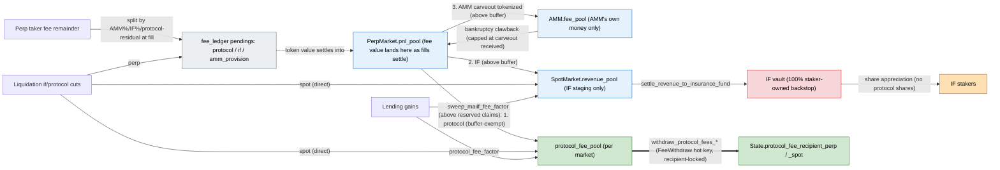

# Fees and revenue

This document has two parts.

- [Current system](#current-system-explicit-fee-carveouts) describes the fee
  system as it exists today, after the June 2026 redesign. It covers the
  explicit per-source protocol and insurance carveouts, the directly
  withdrawable protocol fee pool, and the 100% staker-owned insurance fund.
- [Historical snapshot](#historical-snapshot-drift-mainnet-market-and-fee-settings)
  records the original Drift mainnet deployment's fee and market settings, read
  live from the deployed program.

The insurance-fund-waterfall design that the redesign replaced is archived in
[FEES-HISTORICAL.md](./FEES-HISTORICAL.md). Nothing in it remains onchain.

---

# Current system: explicit fee carveouts

Protocol fees sit outside the protocol's backstop. Nothing the protocol earns
is at risk in a bankruptcy, and the protocol withdraws it on demand instead of
routing it through insurance-fund shares. Every fee source splits explicitly
between the protocol and the insurance fund at the moment it is charged, which
retires the revenue-pool waterfall, the settlement-time share mint, and the
dual insurance fund.

Throughout this section, a *carveout* is one piece of a fee that the split
assigns to a specific claimant. The trade-fee remainder produces three of them
(AMM, insurance, protocol), and lending interest produces two (insurance,
protocol).

## Trade-fee waterfall (perps)

A perp charges one tiered taker fee. Fixed deductions come off the top, two
global percentages split what is left, and the builder fee is added on top.

```
taker_fee  = ceil(notional × fee_numerator / FEE_DENOMINATOR)   tier by 30d volume, floored by
           + notional × taker_fee_addon_tenth_bps / FEE_DENOMINATOR      State.promo_fee_tier
           then ± per-market fee_adjustment
          − referee_discount          (reduces what the taker pays; never collected)
          − referrer_reward           (to the referrer, via RevenueShareEscrow)
          − filler_reward             (to the keeper, as perp quote PnL)
          − maker_rebate              (to the maker; match path only)
          ───────────────────────────
remainder − vAMM maker rebate  (AMM path only, while FeatureBitFlags::VammMakerRebate is set;
          │                     deducted before the split, then folded into the AMM carveout)
          │
          ── × amm_fee_numerator/100 → AMM carveout (booked into the AMM's ledger at fill,
          │                                          tokenized into amm.fee_pool by the sweep;
          │                                          clawable in bankruptcy as the backstop of
          │                                          last resort, tracked in
          │                                          amm_protocol_fees_received)
          ── × if_fee_numerator/100  → insurance carveout (pending_if_fee → revenue_pool → IF vault)
          ── residual                → protocol carveout (pending_protocol_fee → protocol_fee_pool)

builder_fee = notional × fee_tenth_bps / 100_000   ADDED on top of taker_fee; pure pass-through
```

The two split percentages live on the global `FeeStructure` as
`amm_fee_numerator` and `if_fee_numerator`, both at precision
`FEE_PERCENTAGE_DENOMINATOR` = 100. The protocol is the residual claimant. The
default is AMM 0% and IF 0%, so the protocol takes 100%.
`validate_fee_structure` enforces `amm + if ≤ 100%`.

The AMM books only its own money. `fee_to_market = amm_fee + spread surplus`,
and the protocol and insurance carveouts never enter the AMM's ledger
(`total_fee_minus_distributions`) or its token pool.

AMM spread surplus (`quote_asset_amount_surplus`, accumulated into
`total_mm_fee`) is not part of the split. It stays the AMM's own income and is
not part of the bankruptcy clawback.

The vAMM maker rebate is an AMM-path addition, active only while
`FeatureBitFlags::VammMakerRebate` is set on `State.feature_bit_flags`. It is
computed off fee tier 0 (`calculate_vamm_maker_rebate`, `math/fees.rs`),
clamped to the remainder, deducted before the three-way split, and then added
to the AMM carveout. Because it rides the AMM carveout's plumbing, enabling the
bit also grows the bankruptcy clawback cap by the rebates the AMM earns.

DLOB matches split the same way, minus the vAMM rebate. The AMM's carveout is
credited to its books by `apply_fill_fees` and tokenized later by the sweep.

Referral rewards come at two independent rates. The standard rate is the active
fee tier's `referrer_reward_numerator`, which a fresh deployment defaults to 10%
of the referee's taker fee. Existing deployments keep whatever the tier already
holds until `update_perp_fee_structure` changes it. The accelerated rate is a
fixed 20% (`ACCELERATED_REFERRER_REWARD_NUMERATOR`) that ignores the tier. The
referee discount stays 5% under both rates.

Accelerated status is a persistent flag on `UserStats`. While the beta-scoped
`ACCELERATED_REFERRAL_ENROLLMENT_ENABLED` constant is true, creating a user
account, filling a perp order as taker or maker, or completing a swap grants it
automatically. A liquidation does not grant it to the liquidatee. Ending
enrollment takes a program upgrade rather than a config change, because it means
flipping the constant and deleting the branches that read it. The warm admin can
grant or revoke it per user at any time with
`update_user_accelerated_referral_status`, and a revoke blocks automatic
reenrollment until a later admin grant.

The fee math lives in `calculate_fee_for_fulfillment_with_amm` and
`calculate_fee_for_fulfillment_with_match` (`math/fees.rs`), both of which call
`split_fee_remainder`.

## The fee ledger

Every per-market fee number lives in one embedded struct,
`PerpMarket.fee_ledger: FeeLedger` (`state/perp_market.rs`), written only
through its accessors:

| Field | Meaning |
|---|---|
| `total_exchange_fee` | lifetime gross taker fees (analytics; same convention on AMM and match paths) |
| `total_liquidation_fee` | lifetime liquidation fees charged (IF + protocol cuts; pure analytics) |
| `pending_protocol_fee` | protocol carveout accrued but not yet materialized |
| `pending_if_fee` | insurance carveout accrued but not yet materialized |
| `amm_protocol_fees_received` | cumulative AMM carveout net of clawbacks (the bankruptcy backstop cap) |
| `pending_amm_provision` | AMM carveout booked into the AMM's ledger at fill but not yet tokenized into `amm.fee_pool` (always ≤ `amm_protocol_fees_received`) |

Accrual goes through `accrue_fill_fees` and `accrue_liquidation_fees`.
Materialization and bankruptcy draws go through `consume_pending_if`,
`consume_pending_protocol`, `consume_pending_amm_provision`, and
`consume_amm_backstop`.

## Accrual and materialization (perps)

Fee value materializes in the pnl pool. Fees debit the payer's position at
fill, and the tokens arrive as fills settle. Carveouts therefore accrue as
pending counters in the fee ledger, and the streaming sweep drains them from
the pnl pool's surplus over live claims. Fee value never passes through the
AMM on its way out.

1. At fill (`controller/orders.rs`), all three carveouts accrue through
   `accrue_fill_fees`, which also records the gross taker fee. The AMM books
   only its own carveout plus spread surplus, via `apply_fill_fees`.
2. The sweep (`sweep_market_fees`, `controller/perp_pools.rs`) reserves the
   pnl-pool tokens that back live claims before any drain. Three reservations
   apply: `max(net_user_pnl, 0)` for users' positive unsettled PnL,
   `min(pending_if_fee, get_pending_if_fee_floor())` for the bankruptcy
   tranche described below, and `pending_revenue_share` for builder and
   referrer fees already accrued out of this pnl pool. What is left funds the
   drains, in order:

   1. `pending_protocol_fee` moves into `PerpMarket.protocol_fee_pool`, where
      it is withdrawable. This drain is exempt from the retention buffer and
      goes first. It sweeps on every settle, so each drain stays small, and its
      value is not recoverable by any later bankruptcy tranche, so holding it
      back would protect nothing.
   2. `pending_if_fee` moves into the quote `SpotMarket.revenue_pool`, and from
      there to the IF vault, leaving the bankruptcy floor behind. The sweep and
      the pnl settles that run it inline are permissionless, so an unfloored
      drain would let anyone clear `resolve_perp_bankruptcy`'s tranche-1 budget
      ahead of a pending resolution and push the loss onto the shared IF or
      into socialization. Two floors apply, and the drain leaves the larger of
      the two.

      A latched bankruptcy holds the whole counter. A liquidation that latches
      a user bankrupt books the debt in `PerpMarket.pending_bankruptcy_claims`,
      and the booking is released when the debt is discharged. While the count
      is above zero the IF drain is frozen, so the tranche covers the loss
      whatever the market's open interest is, and whether or not the standing
      floor below is configured.

      Before any latch, a standing tranche applies. `bankruptcy_if_floor_pct`
      of open-interest notional, valued at the market's oracle TWAP, stays in
      `pending_if_fee`. This covers the case a latch cannot, which is a
      resolution that admits the user in the same instruction, or a
      cross-margin estate whose debt sits in a market the latching instruction
      did not declare writable. A stored `0` means
      `DEFAULT_BANKRUPTCY_IF_FLOOR_PCT` (10 bps), which is what a market
      written before the field existed reads.
      `update_perp_market_bankruptcy_if_floor_pct` sets it per market, and
      `BANKRUPTCY_IF_FLOOR_DISABLED` turns it off.

      The final delisting sweep (`force`) bypasses both floors. The delist
      handler rejects while `pending_bankruptcy_claims` is above zero, so every
      bankruptcy is resolved before wind-down, and the pnl pool is drained
      wholesale right after.
   3. `pending_amm_provision` is tokenized into `amm.fee_pool`. The AMM's
      ledger was already credited at fill, so this is a pure token transfer.

   Drains 2 and 3 also leave the `fee_pool_buffer_target` retention margin
   behind. The buffer throttles the outflows whose value the bankruptcy
   waterfall can still reach. An unswept insurance carveout even upgrades
   coverage, because market-local tranche-1 forgiveness is uncapped while the
   shared vault is capped. Drains 1 and 2 never touch the AMM's books or pools.
   Undrained remainders wait for the next sweep. This is the only fee routing
   out of a perp market.

   The sweep runs inline on every pnl settle (`update_pool_balances`, after the
   user's settle so the sweep cannot starve it) and on demand through the
   permissionless `sweep_perp_market_fees` keeper instruction. It emits
   `PerpMarketFeeSweepRecord`. `fee_pool_buffer_target` is per-market,
   initialized to `FEE_POOL_TO_REVENUE_POOL_THRESHOLD` (250 QUOTE) and set with
   `update_perp_market_fee_pool_buffer_target`.
3. No funding floor is needed. `total_fee_minus_distributions` contains only
   the AMM's own equity, so funding, repeg, and k-updates may spend it down to
   zero. The drawdown breaker and `is_underwater` are the remaining guards. The
   old floors are gone: the pendings-based funding floor,
   `SHARE_OF_FEES_ALLOCATED_TO_DRIFT`, and `protocol_floor`.

## Liquidations

Three per-market rates apply, all at `LIQUIDATION_FEE_PRECISION` = 1e6.
`liquidator_fee` and `if_liquidation_fee` are unchanged from the old design,
and `protocol_liquidation_fee` is new.

`liquidator_fee` goes to the liquidator, exactly as before.

The insurance-side budget is computed once with the existing margin-aware
formula, at a cap of `if_liquidation_fee + protocol_liquidation_fee`, and then
split insurance-first. The IF receives exactly what it would have received without the
protocol fee, and the protocol captures only the margin headroom beyond that,
up to its own flat rate. The combined fee therefore stays inside the margin
budget and can never push a liquidation into spurious bankruptcy. The budget
math is `calculate_perp_if_fee` and `calculate_spot_if_fee`
(`math/liquidation.rs`), and the split is applied in
`controller/liquidation.rs`.

On a perp liquidation the insurance carveout accrues to `pending_if_fee` and
the protocol carveout accrues to `pending_protocol_fee`, with
`total_liquidation_fee` recording both as lifetime analytics. On a spot
liquidation both carveouts are written directly, the insurance one into the
liability market's `revenue_pool` and the protocol one into its
`protocol_fee_pool`.

## The AMM as backstop of last resort

The `amm_fee_numerator` carveout is real, spendable AMM liquidity, and no floor
reserves it. What distinguishes it from the AMM's other capital is that the
market tracks the cumulative amount in `fee_ledger.amm_protocol_fees_received`,
and a perp bankruptcy claws back whatever is still recoverable. The resolution
waterfall is `resolve_perp_bankruptcy` (`controller/liquidation.rs`):

1. `pending_if_fee`, the market's own in-transit insurance carveout. This
   tranche is counter-only. The pending claim and the forgiven loss are both
   claims on future pnl-pool inflows, so canceling one against the other needs
   no token movement. The sweep keeps this tranche stocked as described above.
   A latch freezes the whole counter, and `bankruptcy_if_floor_pct` holds a
   standing floor before any latch, so a front-running sweep cannot clear it.
2. The insurance fund vault, bounded by the market's `insurance_claim` caps.
   These are real tokens moving into the pnl pool.
3. The AMM clawback, capped at `amm_protocol_fees_received`, in two phases.
   First the not-yet-tokenized `pending_amm_provision` is consumed
   counter-only. Then tokenized carveout moves from `amm.fee_pool` to
   `pnl_pool`, capped by what the fee pool actually holds. Both phases debit
   the AMM's books through `record_amm_pnl`, since the carveout was credited at
   fill, and both dent the drawdown breaker.
4. Socialization across counterparties.

The AMM's own spread and trading capital beyond the carveout is never tapped,
and bankruptcy does not touch the external LP pool (VLP constituent vaults) at
all. The clawback is best-effort, because the AMM may already have spent the
carveout on curve costs, so the cap is
`min(amm_protocol_fees_received, pending + fee-pool tokens)`.

## Lending

Deposit-interest gains carry two carveouts, applied in
`update_spot_market_cumulative_interest` (`controller/spot_balance.rs`) at
precision `IF_FACTOR_PRECISION` = 1e6. `InsuranceFund.if_fee_factor` routes its
share to the `revenue_pool`, and from there to the staker-owned IF.
`SpotMarket.protocol_fee_factor` routes its share to the withdrawable
`protocol_fee_pool`. Lenders receive the rest. Both factors are set together by
`update_spot_market_if_factor`, which validates that their sum is strictly
below 100% so lenders always keep a configured share.

`split_deposit_interest` carries the index-space remainder, and each pool
carries its own token-space remainder, so a share too small to round to a whole
index unit is delayed rather than lost. Both carveouts convert to tokens against
the same `deposit_balance`, before either pool is credited, so neither one is
sized against a balance the other has already raised.

## Insurance fund: 100% staker-owned

`revenue_pool` has exactly one purpose, which is staging insurance carveouts.
Its only exit is `settle_revenue_to_insurance_fund`. Once stakers exist
(`user_shares > 0`), each settle is throttled to the lesser of one tenth of the
revenue pool and a `MAX_APR_PER_REVENUE_SETTLE_TO_INSURANCE_FUND_VAULT` cap
over the period. That APR cap is sized off
`min(insurance_vault_amount, if_last_settle_vault_amount)`, the lowest balance
the vault held across the whole period, so a direct SPL transfer made just
before a settle cannot inflate it. When depositor claims run below the revenue
pool's token amount, only half the available withdraw is allowed.

There are no protocol shares. The settle-time protocol mint, the
`total_factor` / `user_factor` split,
`admin_withdraw_from_insurance_fund_vault`, and
`transfer_protocol_if_shares_to_revenue_pool` are all removed. 100% of every
settle accrues to stakers as share-price appreciation. An operating company
that wants IF exposure stakes like anyone else.

A no-staker bootstrap covers the cold start. While `total_shares == 0`, fees
still build the backstop, and the first settle (or first stake) seeds
`total_shares` 1:1 with the vault so the first staker mints at a share price of
about 1 instead of receiving 0 shares. Those seeded shares are protocol-owned,
permanent, and not withdrawable, since the withdraw and transfer instructions
that could have moved them are gone.

The IF still pays bankruptcies through `resolve_perp_bankruptcy` and
`resolve_spot_bankruptcy`. It is the protocol's only backstop, and protocol
fees are never part of it.

## Protocol fee custody and withdrawal

Every market carries a `protocol_fee_pool: PoolBalance`, a protocol-owned
Deposit-type claim inside the existing spot vault. Perp pools are
quote-denominated against the quote spot market, like `pnl_pool`. The balance
is counted in `deposit_balance`, it is owned by the protocol rather than by
users, and it is never part of the backstop.

Two instructions move it out, `withdraw_protocol_fees_spot(market_index,
amount)` and `withdraw_protocol_fees_perp(market_index, amount)`, both in
`instructions/protocol_fees/`. The signer is the `FeeWithdraw` hot key
(`HotRole::FeeWithdraw`, stored as `State.hot_fee_withdraw` and set with
`update_hot_admin`), which supports something like a daily withdrawal bot.

Funds go to the associated token account of the configured recipient, created
on demand with `init_if_needed`. Perp (quote) withdrawals pay
`State.protocol_fee_recipient_perp` and spot (per-market token) withdrawals pay
`State.protocol_fee_recipient_spot`, two separately configurable treasuries.
The `recipient` account is `address`-constrained to the matching state field,
so a wrong recipient fails with `InvalidProtocolFeeRecipient`. Only `cold_admin`
can set either field, through `update_protocol_fee_recipient(recipient,
market_type)`. An unset recipient leaves that side's withdrawals inert.

Depositors are protected twice over. The withdrawal is capped at the pool's own
balance, and `validate_spot_market_vault_amount` re-checks afterwards that the
vault still covers every remaining claim. A withdrawal can never reach user
deposits. Each one emits `ProtocolFeeWithdrawRecord`.

## Flow diagram



## Reference

| Item | Location |
|---|---|
| Split numerators + validation | `FeeStructure.amm_fee_numerator`/`if_fee_numerator` (protocol = residual) (`state/state.rs`); `validation/fee_structure.rs` |
| Fee ledger | `PerpMarket.fee_ledger: FeeLedger` + accessors (`state/perp_market.rs`) |
| AMM carveout / clawback cap | `fee_ledger.amm_protocol_fees_received` + `pending_amm_provision`; clawback in `resolve_perp_bankruptcy` |
| vAMM maker rebate | `calculate_vamm_maker_rebate` (`math/fees.rs`, AMM path only); gated by `FeatureBitFlags::VammMakerRebate` (`state/state.rs`); folded into the AMM carveout, so it also raises the clawback cap |
| Waterfall math | `math/fees.rs` (`split_fee_remainder`, `FillFees.protocol_fee`/`if_fee`/`amm_fee`) |
| Pending counters | `fee_ledger.pending_protocol_fee`/`pending_if_fee`/`pending_amm_provision` |
| Streaming sweep | `sweep_market_fees` (`controller/perp_pools.rs`, source = pnl pool); inline via `update_pool_balances`, on demand via `sweep_perp_market_fees` (keeper); emits `PerpMarketFeeSweepRecord` |
| Sweep reservations | `max(net_user_pnl, 0)` + `PerpMarket.get_bankruptcy_if_tranche_reservation` + `PerpMarket.pending_revenue_share` (`state/perp_market.rs`) |
| Sweep buffer | `PerpMarket.fee_pool_buffer_target`, the pnl-pool retention above the reserved claims for the IF/carveout drains; the protocol drain is buffer-exempt (`update_perp_market_fee_pool_buffer_target`) |
| Bankruptcy IF floor | `PerpMarket.bankruptcy_if_floor_pct` / `pending_bankruptcy_claims`; `get_pending_if_fee_floor` / `get_bankruptcy_if_floor` (`state/perp_market.rs`); `DEFAULT_BANKRUPTCY_IF_FLOOR_PCT` (10 bps) / `BANKRUPTCY_IF_FLOOR_DISABLED` (`math/constants.rs`) |
| AMM ledger recompute | `calculate_perp_market_amm_summary_stats` (`math/perp_market.rs`): `tfmd = pools − net_user_pnl − pending_protocol − pending_if − pending_revenue_share` |
| Dead post-isolation | funding/curve floors (`protocol_floor`, `SHARE_OF_FEES_ALLOCATED_TO_DRIFT`, pendings funding floor), `amm.total_fee_withdrawn` (frozen), the settle_pnl `fee_pool/5` buffer |
| Liquidation split | `controller/liquidation.rs` (perp ×2 + spot ×2 paths); rates on Perp/SpotMarket |
| Lending carveouts | `controller/spot_balance.rs:update_spot_market_cumulative_interest`; `InsuranceFund.if_fee_factor`, `SpotMarket.protocol_fee_factor`; `split_deposit_interest` |
| IF bootstrap | `controller/insurance.rs` (`settle_revenue_to_insurance_fund`, `add_insurance_fund_stake`) |
| Withdrawal | `instructions/protocol_fees/`; `State.protocol_fee_recipient_perp`/`_spot` + `hot_fee_withdraw`; `HotRole::FeeWithdraw` |
| Admin setters | `update_perp/spot_market_liquidation_fee` (+protocol rate), `update_spot_market_if_factor` (if_fee_factor, protocol_fee_factor), `update_protocol_fee_recipient`, `update_perp/spot_fee_structure`, `update_perp_market_fee_pool_buffer_target`, `update_perp_market_bankruptcy_if_floor_pct`, `update_user_accelerated_referral_status` |
| Event | `ProtocolFeeWithdrawRecord`, `AcceleratedReferralStatusChangedRecordV0`; `protocol_fee` on liquidation records |

---

# Historical snapshot: Drift mainnet market and fee settings

Read live from the deployed program. The values are a point-in-time snapshot.

- Program ID: `dRiftyHA39MWEi3m9aunc5MzRF1JYuBsbn6VPcn33UH`
- Cluster: mainnet-beta (genesis `5eykt4UsFv8P8NJdTREpY1vzqKqZKvdpKuc147dw2N9d`)
- Perp markets: 86. Spot markets: 66.
- State PDA: `5zpq7DvB6UdFFvpmBPspGPNfUGoBRRCE2HHg5u3gxcsN`
- `max_initialize_user_fee`: 0 (lamports basis; Solana rent, not revenue)

## Global fee structure (`State`)

Fee tiers apply by 30d volume and gov-token stake, with selection logic in `math/fees.rs`. Liquidation and IF fees are per-market, listed below.

### Perp fee tiers (`perpFeeStructure`)

flat_filler_fee=3000 · referrer_reward_epoch_upper_bound=1000000000000

| Tier | Taker | Maker rebate | Referrer reward | Referee discount |
|---|---|---|---|---|
| 0 | 3.5 bps | 0.2 bps | 35% | 5% |
| 1 | 3 bps | 0.25 bps | 35% | 5% |
| 2 | 2.75 bps | 0.25 bps | 0% | 0% |
| 3 | 2.5 bps | 0.25 bps | 0% | 0% |
| 4 | 2.25 bps | 0.25 bps | 0% | 0% |
| 5 | 2 bps | 0.25 bps | 0% | 0% |
| 6 | 0 bps | 0 bps | 0% | 0% |
| 7 | 0 bps | 0 bps | 0% | 0% |
| 8 | 0 bps | 0 bps | 0% | 0% |
| 9 | 0 bps | 0 bps | 0% | 0% |

### Spot fee tiers (`spotFeeStructure`)

flat_filler_fee=3000

| Tier | Taker | Maker rebate | Referrer reward | Referee discount |
|---|---|---|---|---|
| 0 | 5 bps | 2 bps | 0% | 0% |
| 1 | 0 bps | 0 bps | 0% | 0% |
| 2 | 0 bps | 0 bps | 0% | 0% |
| 3 | 0 bps | 0 bps | 0% | 0% |
| 4 | 0 bps | 0 bps | 0% | 0% |
| 5 | 0 bps | 0 bps | 0% | 0% |
| 6 | 0 bps | 0 bps | 0% | 0% |
| 7 | 0 bps | 0 bps | 0% | 0% |
| 8 | 0 bps | 0 bps | 0% | 0% |
| 9 | 0 bps | 0 bps | 0% | 0% |

## Spot markets: fee and insurance-fund settings

`liquidatorFee` / `ifLiquidationFee` in 1e6 precision (shown as %). `totalFactor` / `userFactor` are the IF revenue split (1e6 precision); `protocol = totalFactor − userFactor`. Periods in seconds.

| idx | name | liq fee | IF liq fee | totalFactor | userFactor | protocol cut | revenueSettlePeriod | unstakingPeriod | totalIfShares | userIfShares | feeAdj | poolId |
|---|---|---|---|---|---|---|---|---|---|---|---|---|
| 0 | USDC | 0% | 0.5% | 100000 (10%) | 49500 (4.95%) | 50500 (5.05%) | 3600 | 1123200 | 3841390135873 | 2352803551671 | 0 | 0 |
| 1 | SOL | 0.75% | 2.25% | 200000 (20%) | 60000 (6%) | 140000 (14%) | 3600 | 1123200 | 846831466655 | 529598367319 | 0 | 0 |
| 2 | mSOL | 0.75% | 3.25% | 100000 (10%) | 50000 (5%) | 50000 (5%) | 3600 | 1123200 | 290829351957 | 284932201251 | 0 | 0 |
| 3 | wBTC | 0.75% | 3.25% | 200000 (20%) | 60000 (6%) | 140000 (14%) | 3600 | 1123200 | 79242087 | 73938559 | 0 | 0 |
| 4 | wETH | 0.75% | 3.25% | 200000 (20%) | 60000 (6%) | 140000 (14%) | 3600 | 1123200 | 1034658373 | 825627540 | 0 | 0 |
| 5 | USDT | 0.5% | 1.5% | 100000 (10%) | 50000 (5%) | 50000 (5%) | 3600 | 1123200 | 13424360235 | 9325421207 | 0 | 0 |
| 6 | jitoSOL | 0.75% | 3.25% | 100000 (10%) | 50000 (5%) | 50000 (5%) | 3600 | 1123200 | 1135103148449 | 1107786735756 | 0 | 0 |
| 7 | PYTH | 1% | 6.5% | 100000 (10%) | 50000 (5%) | 50000 (5%) | 3600 | 1123200 | 26844425810 | 25661139614 | 100 | 0 |
| 8 | bSOL | 0.75% | 3.25% | 100000 (10%) | 50000 (5%) | 50000 (5%) | 3600 | 1123200 | 223832478078 | 219871983949 | 0 | 0 |
| 9 | JTO | 1% | 6.5% | 100000 (10%) | 50000 (5%) | 50000 (5%) | 3600 | 1123200 | 3646907730861 | 3518498871697 | 100 | 0 |
| 10 | WIF | 1.5% | 8.5% | 350000 (35%) | 105000 (10.5%) | 245000 (24.5%) | 3600 | 1123200 | 1477522289 | 1149379773 | 100 | 0 |
| 11 | JUP | 1% | 6.5% | 100000 (10%) | 50000 (5%) | 50000 (5%) | 3600 | 1123200 | 78164942473 | 71963678016 | 100 | 0 |
| 12 | RENDER | 1% | 6.5% | 100000 (10%) | 50000 (5%) | 50000 (5%) | 3600 | 1123200 | 171558155494 | 170863688410 | 0 | 0 |
| 13 | W | 1% | 6.5% | 350000 (35%) | 105000 (10.5%) | 245000 (24.5%) | 3600 | 1123200 | 172447929990 | 162096194728 | 100 | 0 |
| 14 | TNSR | 1% | 6.5% | 100000 (10%) | 50000 (5%) | 50000 (5%) | 3600 | 1123200 | 2645760579665 | 1533472262698 | 100 | 0 |
| 15 | DRIFT | 1.5% | 6% | 100000 (10%) | 100000 (10%) | 0 (0%) | 3600 | 1123200 | 18911558334102 | 16500005801389 | 100 | 0 |
| 16 | INF | 0.75% | 3.25% | 100000 (10%) | 50000 (5%) | 50000 (5%) | 3600 | 1123200 | 189162327287 | 183827022920 | 0 | 0 |
| 17 | dSOL | 0.75% | 3.25% | 100000 (10%) | 50000 (5%) | 50000 (5%) | 3600 | 1123200 | 43000772394 | 40790722104 | 0 | 0 |
| 18 | USDY | 0.75% | 1.25% | 100000 (10%) | 50000 (5%) | 50000 (5%) | 3600 | 1123200 | 1852339743 | 1572452016 | 0 | 0 |
| 19 | JLP | 0.75% | 3.25% | 100000 (10%) | 50000 (5%) | 50000 (5%) | 3600 | 1123200 | 4188128427 | 4085293543 | 0 | 0 |
| 20 | POPCAT | 1.5% | 8.5% | 100000 (10%) | 50000 (5%) | 50000 (5%) | 3600 | 1123200 | 93543792894 | 65041017930 | 100 | 0 |
| 21 | CLOUD | 1% | 6.5% | 100000 (10%) | 50000 (5%) | 50000 (5%) | 3600 | 1123200 | 23060265076073 | 19701735508904 | 0 | 0 |
| 22 | PYUSD | 0.75% | 1.25% | 100000 (10%) | 30000 (3%) | 70000 (7%) | 3600 | 1123200 | 39877504834 | 22220035258 | 0 | 0 |
| 23 | USDe | 1.75% | 6.25% | 350000 (35%) | 105000 (10.5%) | 245000 (24.5%) | 3600 | 1123200 | 931581136330 | 876452274562 | 0 | 0 |
| 24 | sUSDe | 1.75% | 6.25% | 100000 (10%) | 50000 (5%) | 50000 (5%) | 3600 | 1123200 | 24917713619 | 16606577830 | 0 | 0 |
| 25 | BNSOL | 0.75% | 3.25% | 100000 (10%) | 50000 (5%) | 50000 (5%) | 3600 | 1123200 | 8895113151 | 7988652351 | 0 | 0 |
| 26 | MOTHER | 1.5% | 8.5% | 200000 (20%) | 60000 (6%) | 140000 (14%) | 3600 | 1123200 | 2873055475 | 1170853168 | 100 | 0 |
| 27 | cbBTC | 0.75% | 3.25% | 100000 (10%) | 50000 (5%) | 50000 (5%) | 3600 | 1123200 | 244307739 | 239931397 | 0 | 0 |
| 28 | USDS | 0.75% | 1.25% | 100000 (10%) | 50000 (5%) | 50000 (5%) | 3600 | 1123200 | 69625670209 | 40823750115 | 0 | 0 |
| 29 | META | 3.25% | 6.25% | 100000 (10%) | 50000 (5%) | 50000 (5%) | 3600 | 1123200 | 3519828 | 3 | 0 | 0 |
| 30 | ME | 1.25% | 3.75% | 100000 (10%) | 50000 (5%) | 50000 (5%) | 3600 | 1123200 | 499619914 | 424380285 | 0 | 0 |
| 31 | PENGU | 1.25% | 4.75% | 100000 (10%) | 50000 (5%) | 50000 (5%) | 3600 | 1123200 | 303465695203 | 284411754681 | 0 | 0 |
| 32 | Bonk | 1.5% | 8.5% | 100000 (10%) | 50000 (5%) | 50000 (5%) | 3600 | 1123200 | 19249996223325 | 19163380360440 | 100 | 0 |
| 33 | JLP-1 | 0.5% | 1.5% | 100000 (10%) | 50000 (5%) | 50000 (5%) | 3600 | 1123200 | 1125509119 | 1119512943 | 0 | 1 |
| 34 | USDC-1 | 0% | 0.05% | 100000 (10%) | 50000 (5%) | 50000 (5%) | 3600 | 1123200 | 176890138354 | 102998348131 | 0 | 1 |
| 35 | AI16Z | 0% | 0% | 100000 (10%) | 50000 (5%) | 50000 (5%) | 3600 | 1123200 | 646690229246 | 549067239575 | 100 | 0 |
| 36 | TRUMP | 1.5% | 7.5% | 100000 (10%) | 50000 (5%) | 50000 (5%) | 3600 | 1123200 | 91814023 | 90118342 | 0 | 0 |
| 37 | MELANIA | 1.5% | 8.5% | 100000 (10%) | 50000 (5%) | 50000 (5%) | 3600 | 1123200 | 110072984 | 101387208 | 100 | 0 |
| 38 | AUSD | 0.75% | 1.25% | 100000 (10%) | 50000 (5%) | 50000 (5%) | 3600 | 1123200 | 1610373945 | 1433509989 | 0 | 0 |
| 39 | FARTCOIN | 3.75% | 6.25% | 100000 (10%) | 50000 (5%) | 50000 (5%) | 3600 | 1123200 | 104794525 | 98845020 | 0 | 0 |
| 40 | JitoSOL-3 | 0.5% | 1.5% | 100000 (10%) | 50000 (5%) | 50000 (5%) | 3600 | 1123200 | 4349650918 | 3313798373 | 0 | 3 |
| 41 | PT-fragSOL-10JUL25 | 0.5% | 1.5% | 100000 (10%) | 50000 (5%) | 50000 (5%) | 3600 | 1123200 | 0 | 0 | 0 | 3 |
| 42 | PT-kySOL-15JUN25-3 | 0.5% | 1.5% | 100000 (10%) | 50000 (5%) | 50000 (5%) | 3600 | 1123200 | 0 | 0 | 0 | 3 |
| 43 | PT-dSOL-30JUN25-3 | 0.5% | 1.5% | 100000 (10%) | 50000 (5%) | 50000 (5%) | 3600 | 1123200 | 0 | 0 | 0 | 3 |
| 44 | JTO-3 | 0.5% | 1.5% | 100000 (10%) | 50000 (5%) | 50000 (5%) | 3600 | 1123200 | 0 | 0 | 0 | 3 |
| 45 | zBTC | 0.75% | 2.25% | 100000 (10%) | 50000 (5%) | 50000 (5%) | 3600 | 1123200 | 22159552 | 21865590 | 0 | 0 |
| 46 | ZEUS | 3.75% | 6.25% | 100000 (10%) | 50000 (5%) | 50000 (5%) | 3600 | 1123200 | 4718047216 | 4614456963 | 0 | 0 |
| 47 | USDC-4 | 0.1% | 0.1% | 20000 (2%) | 10000 (1%) | 10000 (1%) | 3600 | 1123200 | 1018102 | 1000001 | 0 | 4 |
| 48 | USDT-4 | 0.1% | 0.1% | 20000 (2%) | 10000 (1%) | 10000 (1%) | 3600 | 1123200 | 135 | 0 | 0 | 4 |
| 49 | SOL-2 | 0.5% | 1.5% | 100000 (10%) | 50000 (5%) | 50000 (5%) | 3600 | 1123200 | 3802649680 | 3074936308 | 0 | 2 |
| 50 | JitoSOL-2 | 0.5% | 1.5% | 100000 (10%) | 50000 (5%) | 50000 (5%) | 3600 | 1123200 | 2790052891 | 2405519939 | 0 | 2 |
| 51 | JTO-2 | 0.5% | 1.5% | 100000 (10%) | 50000 (5%) | 50000 (5%) | 3600 | 1123200 | 0 | 0 | 0 | 2 |
| 52 | dfdvSOL | 0.5% | 1.5% | 100000 (10%) | 50000 (5%) | 50000 (5%) | 3600 | 1123200 | 63649152 | 55305703 | 0 | 0 |
| 53 | sACRED-4 | 1% | 1% | 20000 (2%) | 10000 (1%) | 10000 (1%) | 3600 | 1123200 | 0 | 0 | 0 | 4 |
| 54 | EURC | 0.75% | 1.25% | 100000 (10%) | 50000 (5%) | 50000 (5%) | 3600 | 1123200 | 22341574768 | 17816682979 | 0 | 0 |
| 55 | PT-fragSOL-31OCT25-3 | 0.5% | 1.5% | 100000 (10%) | 50000 (5%) | 50000 (5%) | 3600 | 1123200 | 5016142 | 0 | 0 | 3 |
| 56 | PUMP | 2.75% | 4.25% | 100000 (10%) | 50000 (5%) | 50000 (5%) | 3600 | 1123200 | 127590149657 | 123918889376 | 0 | 0 |
| 57 | syrupUSDC | 0.5% | 1.25% | 100000 (10%) | 50000 (5%) | 50000 (5%) | 3600 | 1123200 | 7130606297 | 6865973409 | 0 | 0 |
| 58 | LBTC | 0.75% | 1.25% | 100000 (10%) | 50000 (5%) | 50000 (5%) | 3600 | 1123200 | 6910624 | 6811307 | 0 | 0 |
| 59 | 2Z | 2.5% | 2.5% | 100000 (10%) | 50000 (5%) | 50000 (5%) | 3600 | 1123200 | 235846849384 | 233099599292 | 0 | 0 |
| 60 | MET | 2.5% | 2.5% | 100000 (10%) | 50000 (5%) | 50000 (5%) | 3600 | 1123200 | 883826378 | 881340026 | 0 | 0 |
| 61 | CASH | 1% | 1% | 100000 (10%) | 50000 (5%) | 50000 (5%) | 3600 | 1123200 | 1103079390 | 820318650 | 0 | 0 |
| 62 | USD1 | 1% | 1% | 100000 (10%) | 50000 (5%) | 50000 (5%) | 3600 | 1123200 | 83696943 | 83316265 | 0 | 0 |
| 63 | Default Market Name | 0% | 0% | 0 (0%) | 0 (0%) | 0 (0%) | 3600 | 1123200 | 0 | 0 | 0 | 0 |
| 64 | Default Market Name | 0% | 0% | 0 (0%) | 0 (0%) | 0 (0%) | 3600 | 1123200 | 0 | 0 | 0 | 0 |
| 65 | Default Market Name | 0% | 0.05% | 0 (0%) | 0 (0%) | 0 (0%) | 3600 | 1123200 | 0 | 0 | 0 | 1 |

### Spot interest-rate curve (context for lending revenue)

Rates in 1e6 precision (shown as %).

| idx | name | optimalUtilization | optimalBorrowRate | maxBorrowRate | minBorrowRate |
|---|---|---|---|---|---|
| 0 | USDC | 80% | 5.25% | 90% | 0.0001% |
| 1 | SOL | 80% | 10% | 150% | 0.0001% |
| 2 | mSOL | 70% | 8% | 100% | 0.0001% |
| 3 | wBTC | 75% | 6% | 150% | 0.0001% |
| 4 | wETH | 75% | 6% | 150% | 0.0001% |
| 5 | USDT | 80% | 8.5% | 125% | 0.0001% |
| 6 | jitoSOL | 80% | 4% | 100% | 0.0001% |
| 7 | PYTH | 70% | 10% | 250% | 0.0001% |
| 8 | bSOL | 70% | 6% | 300% | 0.0001% |
| 9 | JTO | 70% | 10% | 250% | 0.0001% |
| 10 | WIF | 70% | 15% | 350% | 0.0001% |
| 11 | JUP | 70% | 25% | 350% | 0% |
| 12 | RENDER | 70% | 25% | 350% | 0% |
| 13 | W | 70% | 20% | 300% | 0% |
| 14 | TNSR | 70% | 6% | 200% | 0.0001% |
| 15 | DRIFT | 50% | 30% | 1000% | 0.001% |
| 16 | INF | 50% | 15% | 500% | 0% |
| 17 | dSOL | 50% | 8% | 500% | 0% |
| 18 | USDY | 80% | 10% | 120% | 0.0001% |
| 19 | JLP | 70% | 6% | 200% | 0.0001% |
| 20 | POPCAT | 70% | 10% | 500% | 0% |
| 21 | CLOUD | 50% | 8% | 500% | 0% |
| 22 | PYUSD | 75% | 10% | 200% | 0.0001% |
| 23 | USDe | 70% | 25% | 500% | 0% |
| 24 | sUSDe | 70% | 25% | 500% | 0% |
| 25 | BNSOL | 80% | 4% | 100% | 0.0001% |
| 26 | MOTHER | 70% | 6% | 200% | 0.0001% |
| 27 | cbBTC | 80% | 5% | 100% | 0.0001% |
| 28 | USDS | 80% | 8.5% | 125% | 0.0001% |
| 29 | META | 70% | 10% | 500% | 0% |
| 30 | ME | 70% | 10% | 500% | 0% |
| 31 | PENGU | 70% | 15% | 500% | 0% |
| 32 | Bonk | 70% | 10% | 500% | 0% |
| 33 | JLP-1 | 50% | 25% | 1500% | 0% |
| 34 | USDC-1 | 80% | 5.25% | 90% | 0.0001% |
| 35 | AI16Z | 70% | 10% | 200% | 0% |
| 36 | TRUMP | 70% | 10% | 200% | 0% |
| 37 | MELANIA | 70% | 6% | 200% | 0.0001% |
| 38 | AUSD | 75% | 10% | 200% | 0.0001% |
| 39 | FARTCOIN | 70% | 12% | 500% | 0% |
| 40 | JitoSOL-3 | 80% | 2% | 50% | 0% |
| 41 | PT-fragSOL-10JUL25 | 80% | 6% | 50% | 0% |
| 42 | PT-kySOL-15JUN25-3 | 80% | 6% | 50% | 0% |
| 43 | PT-dSOL-30JUN25-3 | 80% | 6% | 50% | 0% |
| 44 | JTO-3 | 80% | 6% | 50% | 0% |
| 45 | zBTC | 70% | 5% | 100% | 0% |
| 46 | ZEUS | 70% | 5% | 100% | 0.0001% |
| 47 | USDC-4 | 80% | 6.5% | 30% | 0% |
| 48 | USDT-4 | 80% | 6.5% | 30% | 0% |
| 49 | SOL-2 | 80% | 6% | 50% | 0% |
| 50 | JitoSOL-2 | 80% | 6% | 50% | 0% |
| 51 | JTO-2 | 70% | 100% | 500% | 0% |
| 52 | dfdvSOL | 80% | 4% | 100% | 0.0001% |
| 53 | sACRED-4 | 70% | 10% | 1000% | 0% |
| 54 | EURC | 80% | 6% | 120% | 0% |
| 55 | PT-fragSOL-31OCT25-3 | 80% | 6% | 50% | 0% |
| 56 | PUMP | 70% | 7% | 200% | 0% |
| 57 | syrupUSDC | 80% | 4% | 90% | 0% |
| 58 | LBTC | 70% | 5% | 100% | 0% |
| 59 | 2Z | 70% | 7% | 100% | 0% |
| 60 | MET | 70% | 7% | 100% | 0% |
| 61 | CASH | 80% | 5% | 120% | 0% |
| 62 | USD1 | 80% | 5% | 120% | 0% |
| 63 | Default Market Name | 50% | 100% | 100% | 0% |
| 64 | Default Market Name | 50% | 100% | 100% | 0% |
| 65 | Default Market Name | 50% | 100% | 100% | 0% |

## Perp markets: fee settings

`liquidatorFee` / `ifLiquidationFee` in 1e6 precision (shown as %). `feeAdjustment` is ±, scales taker fee & maker rebate. `lpFeeTransferScalar` / `lpExchangeFeeExcluscionScalar` are %-of (0-100) routing to the LP pool. AMM counters are lifetime cumulative (QUOTE precision, 1e6).

| idx | name | quote mkt | liq fee | IF liq fee | feeAdj | lpFeeXferScalar | lpExchFeeExclScalar | poolId |
|---|---|---|---|---|---|---|---|---|
| 0 | SOL-PERP | 0 | 0.75% | 0.75% | 0 | 4 | 2 | 0 |
| 1 | BTC-PERP | 0 | 0.5% | 0.75% | 0 | 0 | 0 | 0 |
| 2 | ETH-PERP | 0 | 0.5% | 0.75% | 0 | 0 | 0 | 0 |
| 3 | APT-PERP | 0 | 1% | 2.5% | 0 | 0 | 0 | 0 |
| 4 | 1MBONK-PERP | 0 | 2.5% | 5% | 0 | 0 | 0 | 0 |
| 5 | POL-PERP | 0 | 1% | 2% | 0 | 0 | 0 | 0 |
| 6 | ARB-PERP | 0 | 1% | 2.5% | 0 | 0 | 0 | 0 |
| 7 | DOGE-PERP | 0 | 1% | 2.5% | 0 | 0 | 0 | 0 |
| 8 | BNB-PERP | 0 | 1% | 2% | 0 | 0 | 0 | 0 |
| 9 | SUI-PERP | 0 | 1% | 2% | 0 | 0 | 0 | 0 |
| 10 | 1MPEPE-PERP | 0 | 2.5% | 5% | 0 | 0 | 0 | 0 |
| 11 | OP-PERP | 0 | 1% | 2% | 0 | 0 | 0 | 0 |
| 12 | RENDER-PERP | 0 | 1% | 2% | 0 | 0 | 0 | 0 |
| 13 | XRP-PERP | 0 | 1% | 2% | 0 | 0 | 0 | 0 |
| 14 | HNT-PERP | 0 | 2.5% | 2.5% | 0 | 0 | 0 | 0 |
| 15 | INJ-PERP | 0 | 2% | 2% | 0 | 0 | 0 | 0 |
| 16 | LINK-PERP | 0 | 2% | 2% | 0 | 0 | 0 | 0 |
| 17 | RLB-PERP | 0 | 2.5% | 2.5% | 0 | 0 | 0 | 0 |
| 18 | PYTH-PERP | 0 | 2.5% | 2.5% | 0 | 0 | 0 | 0 |
| 19 | TIA-PERP | 0 | 2% | 2% | 0 | 0 | 0 | 0 |
| 20 | JTO-PERP | 0 | 2.5% | 2.5% | 0 | 0 | 0 | 0 |
| 21 | SEI-PERP | 0 | 2% | 2% | 0 | 0 | 0 | 0 |
| 22 | AVAX-PERP | 0 | 1% | 2% | 0 | 0 | 0 | 0 |
| 23 | WIF-PERP | 0 | 2.5% | 5% | 0 | 0 | 0 | 0 |
| 24 | JUP-PERP | 0 | 2% | 2.5% | 0 | 0 | 0 | 0 |
| 25 | DYM-PERP | 0 | 2.5% | 4.5% | 0 | 0 | 0 | 0 |
| 26 | TAO-PERP | 0 | 2.5% | 4.5% | 0 | 0 | 0 | 0 |
| 27 | W-PERP | 0 | 3% | 4.5% | 0 | 0 | 0 | 0 |
| 28 | KMNO-PERP | 0 | 1% | 2% | 0 | 0 | 0 | 0 |
| 29 | TNSR-PERP | 0 | 1% | 5% | 0 | 0 | 0 | 0 |
| 30 | DRIFT-PERP | 0 | 1% | 5% | 0 | 0 | 0 | 0 |
| 31 | CLOUD-PERP | 0 | 4.5% | 4.5% | 0 | 0 | 0 | 0 |
| 32 | IO-PERP | 0 | 4.5% | 4.5% | 0 | 0 | 0 | 0 |
| 33 | ZEX-PERP | 0 | 4.5% | 4.5% | 0 | 0 | 0 | 0 |
| 34 | POPCAT-PERP | 0 | 2.5% | 5% | 0 | 0 | 0 | 0 |
| 35 | 1KWEN-PERP | 0 | 2.5% | 5% | 0 | 0 | 0 | 0 |
| 36 | TRUMP-WIN-2024-BET | 0 | 2.5% | 2.5% | 0 | 0 | 0 | 0 |
| 37 | KAMALA-POPULAR-VOTE-2024-BET | 0 | 2.5% | 2.5% | 0 | 0 | 0 | 0 |
| 38 | FED-CUT-50-SEPT-2024-BET | 0 | 2.5% | 2.5% | 0 | 0 | 0 | 0 |
| 39 | REPUBLICAN-POPULAR-AND-WIN-BET | 0 | 2.5% | 2.5% | 0 | 0 | 0 | 0 |
| 40 | BREAKPOINT-IGGYERIC-BET | 0 | 2.5% | 2.5% | 0 | 0 | 0 | 0 |
| 41 | DEMOCRATS-WIN-MICHIGAN-BET | 0 | 2.5% | 2.5% | 0 | 0 | 0 | 0 |
| 42 | TON-PERP | 0 | 1% | 5% | 0 | 0 | 0 | 0 |
| 43 | LANDO-F1-SGP-WIN-BET | 0 | 2.5% | 2.5% | 0 | 0 | 0 | 0 |
| 44 | MOTHER-PERP | 0 | 2.5% | 5% | 0 | 0 | 0 | 0 |
| 45 | MOODENG-PERP | 0 | 2.5% | 5% | 0 | 0 | 0 | 0 |
| 46 | WARWICK-FIGHT-WIN-BET | 0 | 2.5% | 2.5% | 0 | 0 | 0 | 0 |
| 47 | DBR-PERP | 0 | 4.5% | 4.5% | 0 | 0 | 0 | 0 |
| 48 | WLF-5B-1W-BET | 0 | 2.5% | 2.5% | 0 | 0 | 0 | 0 |
| 49 | VRSTPN-WIN-F1-24-DRVRS-CHMP | 0 | 2.5% | 2.5% | 0 | 0 | 0 | 0 |
| 50 | LNDO-WIN-F1-24-US-GP | 0 | 2.5% | 2.5% | 0 | 0 | 0 | 0 |
| 51 | 1KMEW-PERP | 0 | 2.5% | 5% | 0 | 0 | 0 | 0 |
| 52 | MICHI-PERP | 0 | 2.5% | 5% | 0 | 0 | 0 | 0 |
| 53 | GOAT-PERP | 0 | 2.5% | 5% | 0 | 0 | 0 | 0 |
| 54 | FWOG-PERP | 0 | 2.5% | 5% | 0 | 0 | 0 | 0 |
| 55 | PNUT-PERP | 0 | 2.5% | 5% | 0 | 0 | 0 | 0 |
| 56 | RAY-PERP | 0 | 1% | 5% | 0 | 0 | 0 | 0 |
| 57 | SUPERBOWL-LIX-LIONS-BET | 0 | 2.5% | 2.5% | 0 | 0 | 0 | 0 |
| 58 | SUPERBOWL-LIX-CHIEFS-BET | 0 | 2.5% | 2.5% | 0 | 0 | 0 | 0 |
| 59 | HYPE-PERP | 0 | 1% | 5% | 0 | 0 | 0 | 0 |
| 60 | LTC-PERP | 0 | 1% | 2% | 0 | 0 | 0 | 0 |
| 61 | ME-PERP | 0 | 1% | 2% | 0 | 0 | 0 | 0 |
| 62 | PENGU-PERP | 0 | 2% | 5% | 0 | 0 | 0 | 0 |
| 63 | AI16Z-PERP | 0 | 2.5% | 5% | 0 | 0 | 0 | 0 |
| 64 | TRUMP-PERP | 0 | 2.5% | 5% | 0 | 0 | 0 | 0 |
| 65 | MELANIA-PERP | 0 | 2.5% | 5% | 0 | 0 | 0 | 0 |
| 66 | BERA-PERP | 0 | 2.5% | 5% | 0 | 0 | 0 | 0 |
| 67 | NBAFINALS25-OKC-BET | 0 | 2.5% | 2.5% | 0 | 0 | 0 | 0 |
| 68 | NBAFINALS25-BOS-BET | 0 | 2.5% | 2.5% | 0 | 0 | 0 | 0 |
| 69 | KAITO-PERP | 0 | 1% | 1.5% | 0 | 0 | 0 | 0 |
| 70 | IP-PERP | 0 | 2.5% | 5% | 0 | 0 | 0 | 0 |
| 71 | FARTCOIN-PERP | 0 | 1% | 1.5% | 0 | 0 | 0 | 0 |
| 72 | ADA-PERP | 0 | 1% | 1.5% | 0 | 0 | 0 | 0 |
| 73 | PAXG-PERP | 0 | 1% | 1.5% | 0 | 0 | 0 | 0 |
| 74 | LAUNCHCOIN-PERP | 0 | 1% | 1.5% | 0 | 0 | 0 | 0 |
| 75 | PUMP-PERP | 0 | 4% | 4% | 0 | 0 | 0 | 0 |
| 76 | ASTER-PERP | 0 | 2% | 2% | 0 | 0 | 0 | 0 |
| 77 | XPL-PERP | 0 | 2% | 2% | 0 | 0 | 0 | 0 |
| 78 | 2Z-PERP | 0 | 2% | 2% | 0 | 0 | 0 | 0 |
| 79 | ZEC-PERP | 0 | 2% | 2% | 0 | 0 | 0 | 0 |
| 80 | MNT-PERP | 0 | 2% | 2% | 0 | 0 | 0 | 0 |
| 81 | 1KPUMP-PERP | 0 | 2% | 2% | 0 | 0 | 0 | 0 |
| 82 | MET-PERP | 0 | 2% | 2% | 0 | 0 | 0 | 0 |
| 83 | 1KMON-PERP | 0 | 2% | 2% | 0 | 1 | 0 | 0 |
| 84 | LIT-PERP | 0 | 2% | 2% | 0 | 1 | 0 | 0 |
| 85 | BP-PERP | 0 | 2% | 2% | 0 | 1 | 0 | 0 |

### Perp AMM cumulative fee counters (lifetime, QUOTE 1e6)

| idx | name | totalExchangeFee | totalFee | totalFeeMinusDistributions | totalMmFee | totalLiquidationFee | totalFeeWithdrawn |
|---|---|---|---|---|---|---|---|
| 0 | SOL-PERP | 17712023264124 | 28761118827914 | 14379467264380 | 11204083405867 | 5587335115012 | 8388743274028 |
| 1 | BTC-PERP | 3405472363596 | 6661517664196 | 4213608205738 | 3279475050791 | 1892503231526 | 1860108591416 |
| 2 | ETH-PERP | 2278809489190 | 5527021370612 | 851024063456 | 3270814725282 | 1389520010627 | 1425394424307 |
| 3 | APT-PERP | 57607371554 | 180265678037 | 242626974582 | 123565271195 | 36502669911 | 41029671135 |
| 4 | 1MBONK-PERP | 469738157696 | 1578209512064 | 1139817670070 | 1112689784197 | 766646475225 | 379031489 |
| 5 | POL-PERP | 29027273510 | 95580546541 | 153059270411 | 67036237102 | 17595909545 | 25804219672 |
| 6 | ARB-PERP | 44793181705 | 140246743107 | 93142318780 | 96099414235 | 42626237500 | 34490345505 |
| 7 | DOGE-PERP | 167368455051 | 450170111391 | 365363576624 | 283304221012 | 154203036944 | 100363421108 |
| 8 | BNB-PERP | 56037416655 | 198728318177 | 278105405315 | 143895319913 | 26007185174 | 33359299498 |
| 9 | SUI-PERP | 495062738573 | 706494569876 | 5121934369813 | 215325012069 | 190588127357 | 260622788722 |
| 10 | 1MPEPE-PERP | 63168380673 | 355080856357 | 408940148850 | 292839868102 | 92566459506 | 0 |
| 11 | OP-PERP | 30997904135 | 97473899747 | 100244471941 | 67158517960 | 23926169064 | 21055650582 |
| 12 | RENDER-PERP | 166262074134 | 451707393577 | 415703969516 | 287164306231 | 122398745044 | 90655419088 |
| 13 | XRP-PERP | 189314534467 | 350863294534 | 290424486139 | 162995435328 | 79451613774 | 101019129687 |
| 14 | HNT-PERP | 27022231473 | 94454276982 | 105219646590 | 68041595552 | 33654595299 | 16386743869 |
| 15 | INJ-PERP | 109336719663 | 360769461170 | 302149584732 | 252914944504 | 82678067373 | 87465930938 |
| 16 | LINK-PERP | 86006805700 | 200904899559 | 191022275612 | 115883959674 | 64002541476 | 59784829043 |
| 17 | RLB-PERP | 7364872086 | 102172145425 | 55183227107 | 95020503531 | 7501638736 | 8776107251 |
| 18 | PYTH-PERP | 137980885627 | 312404116638 | 235102430384 | 175730506688 | 169358237873 | 106058937555 |
| 19 | TIA-PERP | 95854740476 | 265747606477 | 296216782351 | 171084684158 | 116635263845 | 54961301082 |
| 20 | JTO-PERP | 146284385785 | -1479772359010 | 6202115131505 | -1624468826982 | 177605502930 | 108708751466 |
| 21 | SEI-PERP | 124098347470 | 295107700652 | 279006943533 | 172392769413 | 122281188207 | 95249947477 |
| 22 | AVAX-PERP | 109053994612 | 289235704063 | 147224330245 | 181086872795 | 80318210891 | 88702322159 |
| 23 | WIF-PERP | 538197496661 | 1963324153657 | 1276352988523 | 1427043101303 | 686189582385 | 0 |
| 24 | JUP-PERP | 582987347402 | 1028900707645 | 2365674102750 | 449985354451 | 453960145518 | 396494557459 |
| 25 | DYM-PERP | 14338501741 | 25063444314 | 27134836906 | 10868502373 | 16332842327 | 12938258813 |
| 26 | TAO-PERP | 62276771044 | 336956802770 | 193383108479 | 275227637814 | 76883462041 | 36309839838 |
| 27 | W-PERP | 32166007326 | 102478407976 | 57983011741 | 70615807194 | 37898029734 | 0 |
| 28 | KMNO-PERP | 16206231156 | 94533657930 | 489415605906 | 78719083312 | 27235288591 | 23854228219 |
| 29 | TNSR-PERP | 46206122059 | 93713102009 | 3000908258822 | 48204106490 | 38525343993 | 29635545556 |
| 30 | DRIFT-PERP | 128148467713 | 314379340562 | 94173062990 | 188114188341 | 254711639157 | 91328616875 |
| 31 | CLOUD-PERP | 7146301776 | 57328327185 | 1766482657 | 50379526326 | 6240933150 | 0 |
| 32 | IO-PERP | 3474486188 | 26983188413 | 62334507883 | 23599982616 | 3091299623 | 0 |
| 33 | ZEX-PERP | 2694826645 | 23152917334 | 34535275358 | 20551232536 | 3806060367 | 1347413322 |
| 34 | POPCAT-PERP | 74166547495 | 175312311145 | 126742419868 | 101927814790 | 121197572803 | 57686525999 |
| 35 | 1KWEN-PERP | 2972203395 | 21706802057 | 5688054964 | 18854191049 | 4656608006 | 1486101697 |
| 36 | TRUMP-WIN-2024-BET | 5004718091 | 5004718091 | 5004718091 | 0 | 34005595 | 0 |
| 37 | KAMALA-POPULAR-VOTE-2024-BET | 15055635191 | 15055635191 | 15055635191 | 0 | 15363992 | 0 |
| 38 | FED-CUT-50-SEPT-2024-BET | 166681334 | 166681334 | 166681334 | 0 | 3100209 | 0 |
| 39 | REPUBLICAN-POPULAR-AND-WIN-BET | 140090357 | 140090357 | 140090357 | 0 | 114440 | 0 |
| 40 | BREAKPOINT-IGGYERIC-BET | 1218981 | 1218981 | 1218981 | 0 | 304031 | 0 |
| 41 | DEMOCRATS-WIN-MICHIGAN-BET | 11403288 | 11403288 | 11403288 | 0 | 15506 | 0 |
| 42 | TON-PERP | 7131649416 | 33341890903 | 620679501911 | 26557687278 | 2799833796 | 3565824708 |
| 43 | LANDO-F1-SGP-WIN-BET | 107876845 | 107876845 | 107876845 | 0 | 0 | 0 |
| 44 | MOTHER-PERP | 6501298772 | 81241758197 | 20834107415 | 75027370791 | 14102552304 | 17353201690 |
| 45 | MOODENG-PERP | 23090270470 | 117465972755 | 159178721733 | 94525311898 | 99669071962 | 11545135235 |
| 46 | WARWICK-FIGHT-WIN-BET | 4754731 | 4754731 | 4754731 | 0 | 0 | 0 |
| 47 | DBR-PERP | 821474579 | 6466588466 | 6322594286 | 5675992844 | 601993407 | 0 |
| 48 | WLF-5B-1W-BET | 5605938 | 5605938 | 5605938 | 0 | 17578507 | 0 |
| 49 | VRSTPN-WIN-F1-24-DRVRS-CHMP | 29763801 | 29763801 | 29763801 | 0 | 619138 | 0 |
| 50 | LNDO-WIN-F1-24-US-GP | 503499 | 503499 | 503499 | 0 | 0 | 0 |
| 51 | 1KMEW-PERP | 1753423812 | 5045784308 | 906445680 | 3355066424 | 322824820 | 0 |
| 52 | MICHI-PERP | 2685967379 | 23908385265 | 37933471103 | 21333191216 | 5895344404 | 0 |
| 53 | GOAT-PERP | 13074526730 | 47108870741 | 80876489840 | 34103646952 | 34255459537 | 0 |
| 54 | FWOG-PERP | 19913411400 | 74145117933 | 154267975096 | 54478397168 | 42358112327 | 9956705700 |
| 55 | PNUT-PERP | 6483636527 | 24412083278 | 48245997102 | 17996781505 | 12153136729 | 3241818263 |
| 56 | RAY-PERP | 33678870553 | -7090197136344 | 217047373512 | -7123470316429 | 56514071358 | 31839405298 |
| 57 | SUPERBOWL-LIX-LIONS-BET | 322362452 | 322362452 | 322362452 | 0 | 2387291 | 0 |
| 58 | SUPERBOWL-LIX-CHIEFS-BET | 219738400 | 219738400 | 219738400 | 0 | 7112002 | 0 |
| 59 | HYPE-PERP | 491624736103 | 1461041784844 | 853889613990 | 977737921113 | 310887595220 | 256012078406 |
| 60 | LTC-PERP | 20629186729 | 60677914397 | 27774983639 | 40191744697 | 8222892838 | 18537486202 |
| 61 | ME-PERP | 5689111832 | -27378972330825 | 60900367 | -27384496153593 | 6469007454 | 9205435934 |
| 62 | PENGU-PERP | 40459842899 | 201015842837 | 133922018531 | 161429660602 | 44057108331 | 20229921449 |
| 63 | AI16Z-PERP | 13821577115 | 24107189547 | 28284351745 | 10416990054 | 27095290571 | 16923664816 |
| 64 | TRUMP-PERP | 82048661035 | 287880937890 | 119399048327 | 206344693579 | 64495871383 | 52224472141 |
| 65 | MELANIA-PERP | 5236012507 | 16992190003 | 10323688663 | 11840731663 | 2772098971 | 5390105224 |
| 66 | BERA-PERP | 14662776847 | 37459184986 | 6478134371 | 23166040251 | 7668618083 | 13469957374 |
| 67 | NBAFINALS25-OKC-BET | 47889402 | 47889402 | 47889402 | 0 | 824805 | 0 |
| 68 | NBAFINALS25-BOS-BET | 7629381 | 7629381 | 7629381 | 0 | 0 | 0 |
| 69 | KAITO-PERP | 3582247406 | -16662782423767 | 3917300971 | -16666137158898 | 1097844076 | 2888967779 |
| 70 | IP-PERP | 10099450332 | 79058250561 | 15612487570 | 69516086268 | 7227987468 | 12277712634 |
| 71 | FARTCOIN-PERP | 86033197155 | 232485804302 | 51107930365 | 147225264533 | 54859393635 | 49721507151 |
| 72 | ADA-PERP | 11017819328 | 20657163793 | 19189637494 | 10111854645 | 4742269967 | 10251179631 |
| 73 | PAXG-PERP | 27869262220 | 36320456461 | 26747767467 | 9011060077 | 5499687657 | 19431737033 |
| 74 | LAUNCHCOIN-PERP | 2552122298 | 40802327062 | 5627053463 | 38336342064 | 790014407 | 1276049776 |
| 75 | PUMP-PERP | 20399147436 | -2217021679838654 | 300408425699 | -2217041792102836 | 28087716774 | 0 |
| 76 | ASTER-PERP | 34776288987 | 106138553397 | 25587526912 | 71835784352 | 34686553030 | 42230118510 |
| 77 | XPL-PERP | 11910179640 | 34504820026 | 25540602828 | 22826574600 | 19174266018 | 25129355838 |
| 78 | 2Z-PERP | 4209298562 | 5577978848 | 7544569313 | 1465822982 | 5175887617 | 7280536898 |
| 79 | ZEC-PERP | 46128734602 | 101712014128 | 23049604634 | 55725985638 | 21481601907 | 8592109162 |
| 80 | MNT-PERP | 5718539081 | 3384170354 | 5425160633 | -2286280056 | 118586005 | 2977855545 |
| 81 | 1KPUMP-PERP | 4643922711 | 15134518327 | 8235941129 | 10650011683 | 1834201830 | 4156163185 |
| 82 | MET-PERP | 3217158984 | 11692877830 | 1104613053 | 8534070931 | 1903560581 | 1376306748 |
| 83 | 1KMON-PERP | 9065560590 | 1674623857 | 5726781334 | -7157383603 | 821942755 | 5354723050 |
| 84 | LIT-PERP | 3754694266 | 20391970284 | 14748677566 | 16672538134 | 1008018036 | 2885365169 |
| 85 | BP-PERP | 49660443 | 435247539 | 735691724 | 389999509 | 0 | 24830221 |
