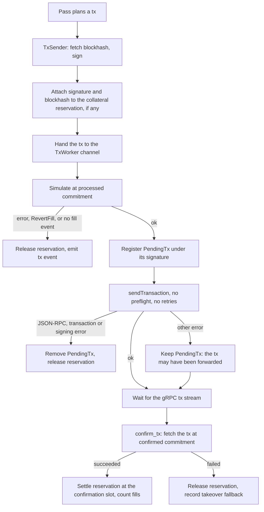

# keep-rs architecture

This document describes how the filler and the liquidator decide what to send and how a
transaction moves from a decision to a confirmed outcome. The README covers configuration and
running the bots.

## Layout

| Path | Contents |
| --- | --- |
| `src/main.rs` | Configuration and the mode switch. Every bot ships in the one `keeprs` binary. |
| `src/common/keeper.rs` | `Keeper`, the handles every pass takes, and `unix_now_ms`. |
| `src/common/oracle.rs` | `ExchangeState`, the exchange oracle observation and its classification, and the pyth-lazer feed. |
| `src/common/tx.rs` | The tx worker and sender, `TxIntent`, pending txs, and shared tx helpers. |
| `src/common/collateral.rs` | `CollateralBook`, the liquidator's collateral reservations. |
| `src/common/grpc.rs` | The gRPC options every bot shares, `subscribe`, and the startup account sync. |
| `src/common/metrics.rs` | Prometheus metrics, `/metrics` and `/health`. |
| `src/filler/` | The filler: `mod.rs` (bot and event loop), `market.rs` (market views and the AMM gate), `auction.rs`, `passes.rs`, `swift.rs`, `stream.rs` (gRPC callbacks). |
| `src/liquidator/` | The liquidator: `mod.rs` (bot, event loop and margin checks), `plan.rs`, `execute.rs`, `worker.rs`, `events.rs` (gRPC callbacks). |
| `src/relayer/`, `src/quoter/`, `src/taker/` | The other bots. |

## Design rules

**The program decides.** Wherever the keeper predicts whether the program will accept a
transaction, it calls the program's own function from the `velocity-rs` program crate instead
of a copy. The program's `msg!` is compiled out under the `velocity-rs` feature, so these calls
print nothing. A prediction only matches the program when the inputs match too, so each
decision reads the same oracle observation and the same market state the program reads at the
landing slot.

**Plan, then execute.** Each pass decides what to send without sending anything, records its
decision in a structured event, and then builds and sends the transactions. Decisions can be
tested and read from logs without a transaction stack.

**One `State` read per decision pass.** The client caches the IDL `State`. The program's own
`State` is zero-copy with a host layout that differs from the onchain bytes, so
`ExchangeState::from_idl` builds a default program `State` and copies in the fields the
program's gates read: `exchange_status`, the slot duration fields and the oracle validity
guard rails. A program gate that starts reading another `State` field needs that field copied
there.

## Oracle observation

A transaction sent in slot `s` lands about one slot later. The program reads the exchange
oracle as it is at that landing slot. `observe_exchange_oracle` produces that one observation:
the cached exchange oracle with its delay aged to the landing slot, or the pyth-lazer update the
transaction posts when that update is newer than the cached oracle. The previewed update
carries the confidence and sequence the program would store.

`classify_perp_oracle` then runs the program's `get_mm_oracle_price_data` and `oracle_validity`
on that observation. The result, `ProjectedPerpOracle`, holds the exchange validity, the safe
price the program selects (the MM oracle when it is fresh and within 1% of the exchange
oracle, else the exchange oracle), the safe validity, and the MM data the AMM gates read.

## Transaction lifecycle

Each bot builds its transactions through `Keeper::tx_builder`, which sets the priority fee and
the compute unit limit as the first two instructions. `scale_cu_limit_for_accounts` raises the
limit when the last instruction lists many accounts.

`TxSender::send_fill_tx` sends a fill with a simulation variant that carries `RevertFill`. The
worker drops the fill if the simulation produces no matching `OrderFill` event, because
`RevertFill` alone only proves the filler was active somewhere in the slot. A fill that posts
a pyth-lazer update keeps `RevertFill` in the broadcast transaction as well.

The worker registers a transaction as pending before it broadcasts, because the transaction can
land, and its confirmation stream in, while the send call is still waiting on the RPC. Only an
error that proves the RPC refused the transaction removes it. The pending buffer holds 1,024
entries. An unconfirmed entry it overwrites is logged and counted as
`tx_failed{reason="evicted_unconfirmed"}`.

On confirmation the worker waits one second, fetches the transaction at confirmed commitment,
parses its fill and trigger events, and emits one `tx` event per transaction to the `tx_event`
log target. A liquidate-with-fill transaction that fails with `LiquidationOrderFailedToFill`,
in simulation or onchain, leaves a takeover fallback marker, which routes the next attempt on
that position to a collateral takeover.

## Filler

### Event loop

`FillerBot::run` selects over five sources and handles one `LoopEvent` per iteration: a swift
order, a swift reconnect timer, a gRPC slot, a pyth-lazer price, and a 15 second watchdog. The
select is biased. When a buffered slot and a ready swift order contend, the loop alternates
between them so neither starves the other. After every event it processes the swift orders
that are ready.

The gRPC slot callback (`stream.rs`) refreshes the DLOB's oracle prices for every market from
one `ExchangeState` read, then forwards the slot. A market whose oracle stays missing for 300
consecutive slots exits the process for a restart. The watchdog exits the process when no slot
arrived for 60 seconds, and resubscribes the swift stream after 300 seconds of silence in case
the websocket is half-open.

### Per slot

On each slot the filler reads `ExchangeState` once and builds a `SlotTick`: the slot, the
landing slot (slot + 1), the priority fee (the 50th percentile plus the slot parity, so
consecutive resubmissions hash differently), the unix time, and the exchange state. Then, for
each market, it builds a `MarketView` and runs four passes in order.

### Market view

`MarketView` (`filler/market.rs`) is one market as the program will see it at the landing
slot. It keeps:

- `market`, the perp market as loaded. The program checks its AMM gates on the market before
  any quote projection, so every gate reads this.
- `posted`, an `OracleView` for transactions that post the pyth-lazer update. It equals the
  chain view when there is no fresh update or the program would not apply it.
- `chain`, an `OracleView` for transactions that post nothing.
- `pyth_update`, the update an auction fill can post. A cached pyth price older than 10 seconds
  is not posted.

Each `OracleView` starts from one exchange observation and holds:

- `oracle`, the classified observation, whose safe price prices oracle-relative orders
- `quote_market`, the market prepared the way the program prepares it before quoting:
  `update_oracle_derived_stats` refreshes the oracle TWAPs, confidence and standard deviation,
  then the curve is projected onto the oracle and the quote state refreshed
  (`velocity_rs::math::amm_quote::project_perp_market_for_quoting`). Crossing and sizing use
  it. The gates never do, because the projection moves the fee and revenue counters the gates
  read.
- `trigger_price`, from the program's `get_trigger_price` on the view's exchange price. The
  trigger instruction reads the exchange oracle, not the safe price.

### AMM gate and sizing

`AmmGate::evaluate` asks the program whether the AMM may fill an order:
`!State::amm_paused()` and `PerpMarket::amm_can_fill_order(order, landing_slot,
FillMode::Fill, state, safe_validity, user_can_skip_auction, mm_oracle)`. Together these are
`fill_perp_order`'s `amm_is_available`, which covers the `AmmFill` pause, drawdown, MM
volatility, oracle validity, order age, the user's and the market's auction skip, inventory,
and JIT appetite. A market with `amm_jit_intensity` 0 still fills low-risk orders. The gate's
other fields only explain the verdict in decision events.

`amm_fill_size` calls the program's `calculate_base_asset_amount_for_amm_to_fulfill`. The
result is already rounded down to the step size, so any size above zero is a fill. The program
applies `min_order_size` only at placement.

### Auction pass

`auction.rs`. The DLOB finds auction crosses at the posted view's safe price and quote market.
For each cross the pass plans:

1. Load the taker and its order. A trigger taker whose condition is not met at the posted
   trigger price is dropped.
2. Model a trigger taker as the trigger instruction leaves it (`order_after_trigger`): the
   condition flipped to triggered, the slot restamped, and `SafeTriggerOrder` set for a
   reduce-only order that rested over 60 seconds.
3. Decide whether to post the pyth-lazer update. The fill posts unless the post is redundant,
   meaning the fill would read identical oracle inputs without it: the raw exchange price and
   confidence, the safe price, confidence, delay, sequence and source, the MM-to-exchange gap,
   the safe validity, and the exchange oracle's FillOrderMatch verdict
   (`ProjectedPerpOracle::same_fill_inputs`). A trigger taker always posts. On a market without
   an MM crank the post is never redundant, because only the post makes the exchange oracle
   fresh in the landing slot.
4. Evaluate the AMM gate on the loaded market with the oracle of the chosen view, and size the
   AMM leg on that view's quote market.
5. Route the cross: fill with the AMM, fill against makers only, or skip. A cross always keeps
   its maker leg when the AMM is gated. A list of fewer than three makers is padded with the
   top makers on the opposite side.
6. Emit a `cross_decision` event.

A skipped cross with a trigger taker still sends the trigger, with the same oracle post its
trigger check used, because the standalone trigger pass leaves crossing trigger orders to this
pass.

Each fill posts its own update. The immediate AMM leg needs an exchange oracle written in the
same slot, and each transaction simulates and lands on its own, so one transaction's post does
not cover another.

### Other passes

`passes.rs` runs three more passes on the same market view.

- **Standalone triggers.** Trigger orders whose condition is met at the chain trigger price but
  that do not cross, for example stop limits that rest after triggering. Orders the auction
  pass already handled are skipped.
- **Limit uncross**, every other slot. The best bid and ask on the chain view each take against
  up to three crossing orders on the other side. Only resting limit orders can act as makers.
  Each leg is recorded in an `uncross_attempt` event.
- **Resting orders against the AMM.** A resting limit that the AMM quote crosses after it was
  placed matches neither the auction pass nor the uncross pass. These fills post nothing, so
  candidates are found, gated and sized on the chain view, with a second DLOB scan when the
  posted and chain views differ. Each candidate is recorded in an `amm_taker_decision` event.

The auction and AMM-taker passes share a per-order rate limiter keyed on `(user, order_id)`.

### Swift orders

`SwiftFeed` (`filler/swift.rs`) owns the swift stream, its reconnect backoff, and a queue of
orders whose signed-message slot is still ahead of the chain. The program refuses an auction
order before its message slot, and the feed delivers each order once, so such an order is held
until its slot arrives. An order stamped more than 10 seconds ahead is dropped, and the queue
holds at most 1,024 orders. A resting limit with no auction is placed on arrival.

For each ready order the filler drops expired orders, builds the market view, and evaluates the
order on the chain view, since swift fill transactions post nothing. An order that crosses
resting liquidity or the AMM is placed and filled in one transaction. A well-formed order that
does not cross yet, including an AMM-only cross the gate keeps closed, is placed onchain so the
per-slot passes can fill it. The order's `bit_flags` are built as `place_perp_order` builds
them. A taker without cached account or stats is treated as unable to skip the auction.

## Liquidator

### Event loop

`LiquidatorBot::run` keeps every non-dust user in memory and watches their margin on a
`MarketState` cache of markets and oracle prices. The gRPC callbacks (`events.rs`) forward
user, perp market, spot market and oracle updates on one channel. The loop drains up to 64
events at a time, and pyth-lazer prices without blocking.

A user's status comes from the maintenance margin with the liquidation buffer: liquidatable
when total collateral is below the requirement, high risk when free margin is under 10% of it,
and safe otherwise. High-risk users are rechecked on every oracle update. Every user is
rechecked every 1,024 batches or every 30 seconds, whichever comes first. A user whose oracles
are older than 20 seconds is not judged. Each liquidatable user is queued as a
`LiquidationRequest` with the fresh pyth prices (at most 5 seconds old) for its perp markets.

### Worker

`worker.rs`. The worker drops a request older than one second, limits each user to one attempt
every two seconds, and backs off a user whose attempts keep skipping, from 5 seconds doubling up
to 5 minutes. Each attempt runs on its own task with a one second deadline and the 60th
percentile priority fee. A sent transaction resets the user's backoff.

### Plan

`plan.rs` decides without sending anything. It values the user's positions on the cached market
state, pairs the largest liability the program lets a liquidator take (by tier) with the best
asset, and picks a route:

| Liability, asset | Route |
| --- | --- |
| only positive perp pnl left | settle pnl |
| perp, none | perp liquidation |
| perp, spot | perp pnl for deposit |
| spot, perp | borrow for perp pnl |
| spot, spot | spot swap through Jupiter or Titan, when enabled |

A perp liquidation walks the user's liquidatable isolated positions, then the largest cross
position, planning and sending one at a time until a transaction goes out. For each position
it reads the oracle validities `liquidate_perp` checks onchain and prefers a fill against
resting makers on the side that absorbs the position. It falls back to a takeover when the
oracle allows a liquidation and a subaccount has the collateral and room for another position.
A takeover fallback marker forces the takeover. Pnl liquidations are sized in the liability's
own units: quote for perp pnl, spot tokens for a borrow. When free collateral cannot cover the
whole liability, a binary search finds the largest amount it can cover.

### Execute

`execute.rs` builds and sends the transaction for each route. Routes that take on a position (a
takeover, pnl for deposit, borrow for pnl) reserve their collateral before sending.

### Collateral reservations

`CollateralBook` (`common/collateral.rs`) keeps, for each liquidator subaccount, the free
collateral of the last chain snapshot with the slot of that snapshot, and every reservation
against it. Available collateral is the snapshot value less the reservations the snapshot does
not include yet. It is computed on read and never stored, so a release cannot create
collateral.

- `try_reserve` checks and reserves under the subaccount's lock, so two concurrent liquidations
  cannot commit the same collateral. It returns a `ReservationGuard` that releases the
  reservation if it is dropped before the tx worker takes the transaction.
- The tx worker settles a reservation at its transaction's confirmation slot, and releases it
  on a failed simulation, a refused send, or an onchain failure.
- A settled reservation counts until a snapshot from a later slot arrives. An account write
  from the confirmation slot itself may precede the transaction.
- The run loop refreshes snapshots every 5 seconds from the cached liquidator subaccounts with
  their account slots. An older snapshot than the one held is ignored.

Nothing is released on time alone. A reconciler runs every 10 seconds:

- An unsettled reservation older than 60 seconds is decided from its transaction's status. A
  confirmed success settles it. A confirmed failure releases it. Absence releases it only once
  the blockhash has expired and a history-enabled status lookup also finds nothing. Any RPC
  error keeps it for the next round.
- A settled reservation whose subaccount has no newer snapshot gets an RPC read of the account
  at confirmed commitment with `min_context_slot` after the confirmation slot. This relies on
  a confirmed block not being rolled back.

### Derisk

Every 30 seconds a loop closes the liquidator subaccounts' own perp positions with reduce-only
market orders, and settles the pnl of positions with no base left.

## Events

Each bot logs one JSON object per line to the `tx_event` target.

| Event | Emitted for |
| --- | --- |
| `tx` | every sent transaction's outcome, keyed by intent (`auction_fill`, `auction_fill_amm`, `swift_fill`, `swift_fill_amm`, `swift_place`, `limit_uncross`, `amm_taker`, `trigger`, and the liquidation intents) |
| `cross_decision` | every auction cross, with its route and each AMM gate input |
| `amm_taker_decision` | every resting-order-vs-AMM candidate that reaches a decision |
| `uncross_attempt` | every uncross leg that reaches a decision |

## Restarts

A bot exits for its supervisor to restart it rather than keep running on dead data. The filler
exits when the slot feed is silent for 60 seconds, when a market's oracle is missing for 300
consecutive slots, or when the slot or pyth feed closes. The liquidator panics its gRPC thread
after 1,000 consecutive failed decodes or lookups, which closes the event channel and ends the
run loop. Each bot's `/health` endpoint fails when a feed it tracks goes stale.
