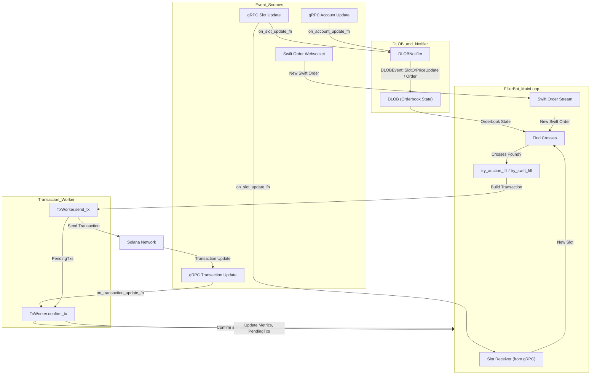
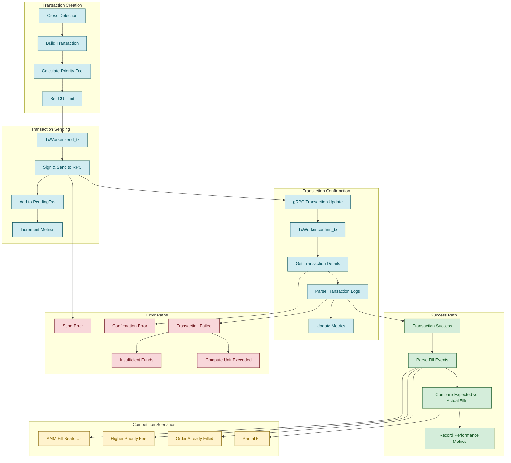

# Rust keeper bots

Keeper bots for Velocity. Every mode ships in the one `keeprs` binary and is picked with a
flag: `--filler` (on by default), `--liquidator`, `--quoter`, `--taker`, `--relayer`. Add
`--dry` to simulate transactions instead of sending them, and `--init-user` to create the
bot's subaccounts before the selected mode starts.

## Configuration

Copy `.env.example` to `.env` and substitute valid RPC credentials.

Required environment variables:

- `BOT_PRIVATE_KEY`: base58 encoded private key
- `RPC_URL`: Solana RPC endpoint
- `GRPC_ENDPOINT`: Velocity gRPC endpoint
- `GRPC_X_TOKEN`: authentication token for gRPC
- `PYTH_LAZER_TOKEN`: Pyth Lazer access token. The filler, liquidator, and relayer all
  read it at startup and panic when it is unset.

Optional: `MARKET_IDS` (default `0,1,2`), `MAINNET` (default `true`), `DRY_RUN`,
`SUBACCOUNTS` (default `0`), `METRICS_PORT` (default `9898`), and `SWIFT_WS_URL` to point
the filler's swift order feed at a different swift ws server. `.env.example` lists the
per-bot knobs. Every bot serves `/metrics`, `/health`, and a dashboard at `/` on
`METRICS_PORT`.

`--mainnet` is a switch, so `--mainnet false` is rejected as an unexpected argument. Set
`MAINNET=false` in the environment to run against devnet.

## Run perp filler

The perp filler matches swift orders and onchain auction orders against resting liquidity.
It also attempts to uncross resting limit orders.

```shell
RUST_LOG=filler=info,dlob=info,swift=info \
    cargo run --release -- --mainnet --filler
```

- use `--dry` flag for tx simulation only

## Run 'perp with fill' liquidator

The liquidator closes liquidatable perp positions against resting limit orders, and spot
borrows with atomic swaps.

```shell
RUST_LOG=liquidator=info,dlob=info,swift=info \
    cargo run --release -- --mainnet --liquidator
```

## Simulate trading on devnet (market maker + taker)

Two bots that together generate realistic two-sided flow. They warm mark TWAPs toward the
live oracle and build AMM inventory on a quiet devnet, which is what the e2e scenarios in
`velocity-rs/tests/devnet_e2e.rs` need. Both ship in the same `keeprs` binary and ECR
image, selected by flag.

**Market maker.** The `--quoter` bot posts resting post-only two-sided limits at
`±--quote-spread-bps` (default **20** bps) around the oracle and refreshes them. For
continuous "always quote ±20bps around oracle" behaviour, set `--quote-refresh-bps 0` so it
re-centres whenever the oracle moves at all. Prefer `--quote-size-notional` (USD,
QUOTE_PRECISION 1e6) over `--quote-size-base` so each quote is the same dollar size on
every market (converted via the oracle):

```shell
RUST_LOG=quoter=info \
    cargo run --release -- --quoter --market-ids 0 \
    --quote-spread-bps 20 --quote-refresh-bps 0 --quote-size-notional 25000000
```

**Taker.** The `--taker` bot sends randomized small **market** orders that cross the
spread, filling the quoter's resting quotes (or the AMM). Direction is a coin-flip, forced
to the inventory-reducing side once `|position|` reaches `--taker-max-base-per-market`
(mean-reverting; `0` disables the bound):

```shell
RUST_LOG=taker=info \
    cargo run --release -- --taker --market-ids 0 \
    --taker-size-base 100000000 --taker-interval-secs 15 \
    --taker-max-base-per-market 1000000000
```

Run the quoter, taker, and a `--filler` (to match them) as separate processes against
devnet. Use `--dry` on either to log intended orders without sending. Both default to
mainnet, so set `MAINNET=false` for devnet.

Taker env knobs: `TAKER_INTERVAL_SECS`, `TAKER_SIZE_BASE`, `TAKER_MAX_BASE_PER_MARKET`
(mirror the flags above).

## Event flow diagram (filler)



## Transaction lifecycle diagram

Covers the paths a fill transaction can take, including failures and losing the race to
another filler.



## Liquidator overview

### 1. Initialization (`LiquidatorBot::new`)

`new` builds the DLOB the strategy matches against and spawns its notifier thread, a
`TxWorker` thread that signs, sends, and confirms transactions, a `MarketState` cache of
market metadata and oracle prices, gRPC subscriptions for users, oracles, and markets, and
a liquidation worker thread that consumes liquidatable users. It skips markets whose name
contains "bet" and markets still in `Initialized` status.

### 2. Main event loop (`LiquidatorBot::run`)

The loop drains up to 64 gRPC events per pass, keeps every user account in memory, and
tracks the ones at high risk. It rechecks high-risk users whenever an oracle price moves,
and rechecks every user once every 1024 cycles or every 30 seconds, whichever comes first.

### 3. Margin status checking

Each user lands in one of three states: **liquidatable** when
`total_collateral < margin_requirement`, **high risk** when free margin is under 10% of the
margin requirement, and **safe** otherwise.

### 4. Liquidation worker thread

The worker receives liquidatable users on a channel and attempts one liquidation per user
at most every 2 seconds, converted to slots at the current slot duration. After a failed
attempt it backs off, starting at 5 seconds and doubling up to a 5 minute cap, and it
prices each transaction at the 60th percentile priority fee.

### 5. Liquidation strategy (`PrimaryLiquidationStrategy`)

For perps the strategy takes the position with the largest notional, asks the DLOB for the
top makers on the side that absorbs it (bids for a long liquidatee, asks for a short), and
builds a `liquidate_perp_with_fill` transaction. With no eligible makers it falls back to
taking the position over with `liquidate_perp`, which it only does when the subaccount
holds enough free collateral.

For spot it takes the largest borrow that is not dust (below twice the market's minimum
order size), uses the largest deposit as collateral, and quotes Jupiter and Titan in
parallel, sending whichever route returns more output tokens. The swap is wrapped in
`liquidate_spot_with_swap_begin` and `liquidate_spot_with_swap_end`. It also runs
`liquidate_perp_pnl_for_deposit` and `liquidate_borrow_for_perp_pnl` where those apply.

### 6. Transaction lifecycle

The strategy builds each transaction with a priority fee and a compute limit and hands it
to the `TxWorker` over the tx sender channel. The worker signs it, sends it, and records it
as pending. gRPC transaction updates then confirm it, update the metrics, and drop it from
the pending set.

## Tx summary

Print recent tx stats for a pubkey (the last 256 signatures).

```bash
 RUST_LOG=info cargo run --release --bin=tx_history <PUBKEY> --rpc-url <RPC_URL>
 ```
