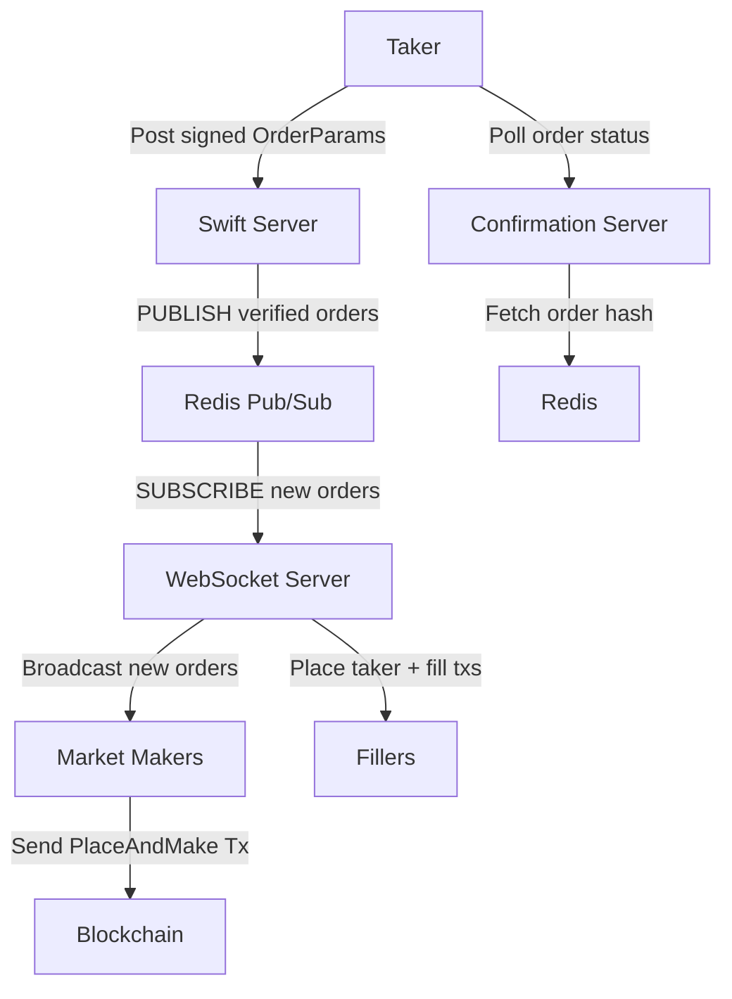

# Swift server

Infrastructure for the Swift order pipeline.

## Architecture

One binary, `swift-server`, runs three components. `--server` picks which one, and it
defaults to `swift`:

- `--server swift`: HTTP server that receives signed order messages from takers, for
  example from the UI. It serves `POST /orders`, `POST /depositTrade`, and `GET /health`,
  and publishes verified orders to Redis.
- `--server ws`: ws server that broadcasts taker orders to market makers. It subscribes to
  the same Redis channel.
- `--server confirmation`: tracks order progress for takers to poll, under
  `GET /confirmation/health`, `/confirmation/hash-status`, and `/confirmation/hashes`.



## Build

```shell
cargo build --release
```

Run it

```shell
./target/release/swift-server --help
```

## Run

The server stack uses Redis pub/sub for sending messages between the `swift_server` and the
`ws_server`. `docker-compose.yml` defines a local Redis instance plus both servers. It
builds the image from this directory, which holds no Dockerfile in the monorepo (the
deployed images build from `docker/rust-app.Dockerfile` at the repo root), so add one
before `docker-compose up`.

### Environment

- `ELASTICACHE_HOST` / `ELASTICACHE_PORT`: Redis host/port (default `localhost:6379`)
- `USE_SSL`: set to `true` to use `rediss://` (TLS)
- `USERMAP_ELASTICACHE_HOST` / `USERMAP_ELASTICACHE_PORT` / `USERMAP_USE_SSL`: the separate
  Redis the swift server reads cached user accounts from
- `ENDPOINT`: Solana RPC url. The swift server requires it; the ws server defaults to
  `https://api.devnet.solana.com`
- `WS_ENDPOINT_*`: one or more Solana ws urls for the slot subscribers. The swift server
  refuses to start with none set
- `HOST` / `PORT`: swift and confirmation server bind address (default `0.0.0.0:3000`)
- `WS_HOST` / `WS_PORT`: ws server bind address (default `0.0.0.0:3000`)
- `METRICS_PORT`: Prometheus endpoint (default `9464`)
- `ENV`: cluster the swift server runs against, `devnet` (default) or `mainnet-beta`. Any
  other value panics at startup
- `IGNORE_PUBKEYS`: comma separated taker authorities whose orders are rejected with a 400
- `DISABLE_RPC_SIM`: set to `true` to skip simulating incoming orders
- `SIM_FEE_PAYER`: fee payer for that simulation. It never signs, but it must exist onchain
  and be rent exempt, otherwise the simulation fails at account loading. Defaults to the
  gas-station-maintained payer
- `AUCTION_ORACLE_BAND_BPS`: rejects a signed order whose auction start/end prices sit more
  than this many bps from the live oracle (default 300, that is 3%; `0` disables)
- `AUCTION_ORACLE_MAX_STALENESS_SLOTS`: skip that band guard when the server's own oracle is
  more than this many slots behind the latest slot, so a stale swift-side oracle cannot
  reject valid orders (default 10, roughly 4s; `0` always applies the band)
- `FAST_CHECK`: set to `true` to derive a ws connection's priority from the maker's
  insurance-fund stake. Otherwise every authenticated connection gets fast priority
