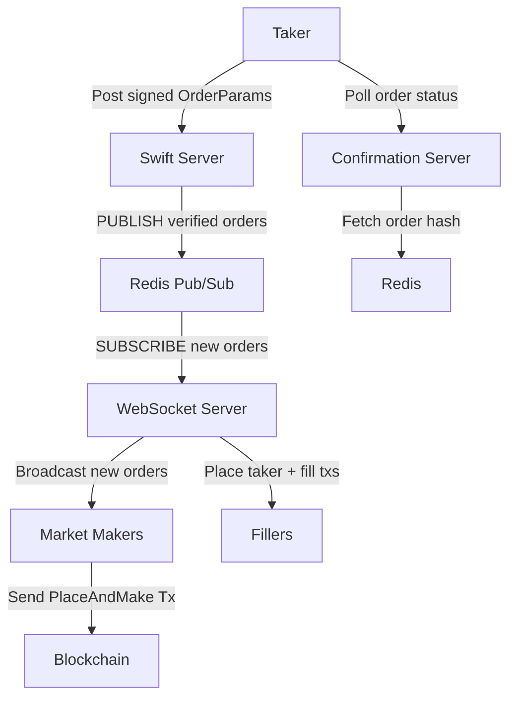

# Swift server

Infrastructure for the Swift order pipeline.

## Architecture

One binary, `swift-server`, runs three components. `--server` picks which one, and it
defaults to `swift`:

- `--server swift`: HTTP server that receives signed order messages from takers, for
  example from the UI. It serves `POST /orders`, `POST /depositTrade`, and `GET /health`,
  and publishes verified orders to Redis.
- `--server ws`: ws server that broadcasts taker orders to market makers. It subscribes to
  the same Redis channel.
- `--server confirmation`: tracks order progress for takers to poll, under
  `GET /confirmation/health`, `/confirmation/hash-status`, and `/confirmation/hashes`.


```mermaid
graph TD
    A[Taker]
    B[Swift Server]
    C[WebSocket Server]
    D[Market Makers]
    E[Redis Pub/Sub]
    F[Blockchain]
    G[Confirmation Server]
    H[Redis]
    I[Fillers]
    A -->|Post signed OrderParams| B
    B -->|PUBLISH verified orders | E
    C -->|Broadcast new orders| D
    D -->|Send PlaceAndMake Tx| F
    E --> |SUBSCRIBE new orders| C
    A -->|Poll order status|G
    G -->|Fetch order hash|H
    C -->|Place taker + fill txs| I
```

## Build

```shell
cargo build --release
```

Run it

```shell
./target/release/swift-server --help
```

## Run

The server stack uses Redis pub/sub for sending messages between the `swift_server` and the
`ws_server`. `docker-compose.yml` defines a local Redis instance plus both servers. It
builds the image from this directory, which holds no Dockerfile in the monorepo (the
deployed images build from `docker/rust-app.Dockerfile` at the repo root), so add one
before `docker-compose up`.

### Environment

- `ELASTICACHE_HOST` / `ELASTICACHE_PORT`: Redis host/port (default `localhost:6379`)
- `USE_SSL`: set to `true` to use `rediss://` (TLS)
- `USERMAP_ELASTICACHE_HOST` / `USERMAP_ELASTICACHE_PORT` / `USERMAP_USE_SSL`: the separate
  Redis the swift server reads cached user accounts from
- `ENDPOINT`: Solana RPC url. The swift server requires it; the ws server defaults to
  `https://api.devnet.solana.com`
- `WS_ENDPOINT_*`: one or more Solana ws urls for the slot subscribers. The swift server
  refuses to start with none set
- `HOST` / `PORT`: swift and confirmation server bind address (default `0.0.0.0:3000`)
- `WS_HOST` / `WS_PORT`: ws server bind address (default `0.0.0.0:3000`)
- `METRICS_PORT`: Prometheus endpoint (default `9464`)
- `ENV`: cluster the swift server runs against, `devnet` (default) or `mainnet-beta`. Any
  other value panics at startup
- `IGNORE_PUBKEYS`: comma separated taker authorities whose orders are rejected with a 400
- `DISABLE_RPC_SIM`: set to `true` to skip simulating incoming orders
- `SIM_FEE_PAYER`: fee payer for that simulation. It never signs, but it must exist onchain
  and be rent exempt, otherwise the simulation fails at account loading. Defaults to the
  gas-station-maintained payer
- `AUCTION_ORACLE_BAND_BPS`: rejects a signed order whose auction start/end prices sit more
  than this many bps from the live oracle (default 300, that is 3%; `0` disables)
- `AUCTION_ORACLE_MAX_STALENESS_SLOTS`: skip that band guard when the server's own oracle is
  more than this many slots behind the latest slot, so a stale swift-side oracle cannot
  reject valid orders (default 10, roughly 4s; `0` always applies the band)
- `FAST_CHECK`: set to `true` to derive a ws connection's priority from the maker's
  insurance-fund stake. Otherwise every authenticated connection gets fast priority
- `SHUTDOWN_DRAIN_SECS`: how long health checks report unhealthy after SIGTERM before
  connections are closed (default 15). See "Shutdown" below
- `SHUTDOWN_CLOSE_SECS`: grace period for connections to flush their goodbyes once draining
  ends, after which the process exits (default 5)

## Shutdown

`util/shutdown.rs` drives SIGTERM through three phases, so that an eviction — a rolling
deploy, a node roll, a cluster autoscaler consolidating — is a reconnect rather than a
dropped feed or a failed order submission. `main.rs` installs the handler once, before it
dispatches, so **all three servers** drain.

The phases:

1. **Drain** (`SHUTDOWN_DRAIN_SECS`): every health route starts failing while the server
   keeps serving normally. This is what gets the pod out of the load balancer's rotation.
   Without it, a client that reconnects or retries immediately can be routed straight back
   to the pod that is about to die.
2. **Close** (`SHUTDOWN_CLOSE_SECS`): the ws server stops accepting and sends every live
   connection a `Close` frame with code `1001` (going away), so clients reconnect on their
   own terms instead of inferring a dead feed from a read error. The swift and confirmation
   servers hand this phase to `axum::serve(..).with_graceful_shutdown(..)`, which stops
   accepting and lets in-flight requests finish.
3. **Exit**: the process exits 0.

### Which route to probe

Point the **readiness** probe at the drain-only route, not the health route:

| Server       | Readiness (drain only)  | Health (deep check)        |
| ------------ | ----------------------- | -------------------------- |
| ws           | `GET /ws/health`        | same route — it has no dependency checks |
| swift        | `GET /ready`            | `GET /health`              |
| confirmation | `GET /confirmation/ready` | `GET /confirmation/health` |

The health routes on the swift and confirmation servers gate on RPC, redis, market subs
and the slot subscriber — dependencies every replica shares. Wiring one of those to a
readiness probe means a single dependency blip marks *every* replica NotReady at once and
the load balancer is left with no targets, which is a harder outage than the degraded
service it was avoiding. The `/ready` routes report the drain phase and nothing else. Keep
the health routes for liveness and alerting.

The metrics listeners are deliberately left serving until exit, so a final scrape works.

Two deployment requirements follow:

- `terminationGracePeriodSeconds` must exceed `SHUTDOWN_DRAIN_SECS + SHUTDOWN_CLOSE_SECS`,
  or the kubelet SIGKILLs the process mid-drain and none of the above happens.
- `SHUTDOWN_DRAIN_SECS` must cover the time it takes traffic to actually stop arriving:
  the readiness probe noticing (`failureThreshold x periodSeconds`) plus however long the
  load balancer takes to stop sending *new* connections to a deregistering target. Note
  this is **not** the target group's `deregistration_delay` — that bounds how long
  *existing* connections may linger, and it can safely be far larger than the drain
  window, since the close phase ends those connections itself.

A drain nobody observes is inert, so at least one probe must be wired to a route that
reports it.

Clients are expected to reconnect. The in-repo subscribers do: the two TypeScript ones
(`packages/sdk/src/swift/swiftOrderSubscriber.ts` and
`apps/keeper-bots-v2/src/experimental-bots/filler-common/swiftOrderSubscriber.ts`) with
jittered exponential backoff, and `keep-rs`'s filler with capped exponential backoff and no
jitter (`rust/keep-rs/src/filler/swift.rs`; `velocity-rs`'s `SwiftOrderStream` itself just ends,
and the filler drives the resubscribe).
